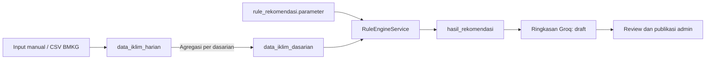

# Dokumentasi Rule Base Rekomendasi Awal Musim Tanam MyFarmer

## 1. Tujuan Dokumen

Dokumen ini menjelaskan landasan akademis, alur data, parameter, algoritma, keluaran, dan keterbatasan *rule base* yang digunakan MyFarmer untuk menghasilkan rekomendasi awal musim tanam padi. Dokumen ditujukan sebagai referensi teknis dan metodologis untuk laporan PKL, pengujian sistem, serta pengembangan lanjutan.

Ruang lingkup dokumen adalah rule **Awal Musim Hujan (AMH)** sebagai indikator awal musim tanam. MyFarmer belum mengimplementasikan rule Awal Musim Kemarau (AMK), model kebutuhan air tanaman, atau prediksi cuaca harian ke depan.

Sumber kebenaran implementasi:

- `myfarmer/app/Services/AggregationService.php`
- `myfarmer/app/Services/RuleEngineService.php`
- `myfarmer/database/seeders/RuleRekomendasiSeeder.php`
- `myfarmer/tests/Feature/AggregationServiceTest.php`
- `myfarmer/tests/Feature/RuleEngineServiceTest.php`

## 2. Istilah dan Definisi Operasional

| Istilah | Definisi dalam MyFarmer |
|---|---|
| CH | Curah hujan dalam milimeter (mm). |
| HH | Hari hujan, yaitu hari dengan CH harian sekurang-kurangnya 0,5 mm. |
| Dasarian | Periode sekitar sepuluh hari: dasarian I tanggal 1–10, dasarian II tanggal 11–20, dan dasarian III tanggal 21–akhir bulan. |
| AMH | Awal Musim Hujan, yang digunakan sebagai indikator ketersediaan hujan untuk memulai musim tanam. |
| Jendela evaluasi | Sejumlah dasarian berurutan yang berakhir pada dasarian yang sedang dievaluasi. Nilai default-nya tiga dasarian. |
| Kriteria utama | Seluruh dasarian dalam jendela memenuhi minimum CH. |
| Kriteria alternatif | Jalur cadangan yang hanya diperiksa ketika kriteria utama gagal; total CH jendela harus mencapai batas alternatif. |
| Kriteria HH | Penguatan opsional yang mewajibkan setiap dasarian mencapai minimum jumlah hari hujan. |

## 3. Landasan Akademis dan Ketertelusuran Keputusan

### 3.1. Kriteria curah hujan BMKG

Surmaini dan Syahbuddin (2016) menjelaskan bahwa kriteria yang umum digunakan untuk menentukan awal musim hujan di Indonesia adalah curah hujan sekurang-kurangnya sekitar 50 mm dalam tiga dasarian berturut-turut. Dasarian pertama dalam rangkaian tersebut ditetapkan sebagai awal musim hujan [2].

MyFarmer mengadopsi prinsip tersebut sebagai **kriteria utama**, dengan nilai batas dan jumlah dasarian disimpan dalam JSON agar dapat dikonfigurasi tanpa mengubah kode program.

### 3.2. Penguatan hari hujan untuk Jawa Timur

Ulfah dan Sulistya (2015) mengkaji data CH dan HH selama 1991–2010 dari 82 pos hujan di Jawa Timur. Penelitian tersebut membandingkan beberapa skenario HH dan menyimpulkan bahwa kriteria alternatif yang sesuai untuk Jawa Timur adalah:

- AMH: CH per dasarian ≥ 50 mm dan HH per dasarian ≥ 3 hari.
- AMK: CH per dasarian < 50 mm dan HH per dasarian < 3 hari [1].

Penelitian tersebut mendefinisikan hari hujan sebagai hari dengan CH ≥ 0,5 mm. Oleh sebab itu, `AggregationService` menghitung `jumlah_hari_hujan` memakai batas yang sama. MyFarmer hanya menggunakan bagian AMH karena tujuan sistem adalah rekomendasi awal tanam padi.

### 3.3. Distribusi hujan dan risiko awal musim semu

Surmaini dan Syahbuddin (2016) menekankan bahwa penentuan waktu tanam tidak cukup hanya mempertimbangkan akumulasi hujan pada awal musim. Distribusi hujan dan kemungkinan deret hari kering setelah tanam juga penting untuk mengurangi risiko *false onset* atau awal musim semu [2].

Kajian tersebut membahas kriteria berbasis data harian, antara lain akumulasi sekurang-kurangnya 40 mm selama lima hari berturut-turut yang tidak diikuti 15 hari kering berturut-turut dalam 30 hari setelahnya. Kriteria harian itu **belum diimplementasikan** di MyFarmer karena rule aktif bekerja pada agregat dasarian aktual, bukan prediksi hujan harian satu bulan ke depan.

### 3.4. Keputusan desain proyek

Tabel berikut membedakan sumber ilmiah dan keputusan operasional proyek.

| Elemen | Sumber | Status dalam MyFarmer |
|---|---|---|
| CH minimum 50 mm per dasarian | Kriteria umum BMKG yang dibahas Surmaini–Syahbuddin [2] dan digunakan Ulfah–Sulistya [1] | Diimplementasikan dan dapat dikonfigurasi. |
| Tiga dasarian berturut-turut | Kriteria umum BMKG yang dibahas Surmaini–Syahbuddin [2] | Diimplementasikan dan dapat dikonfigurasi. |
| HH minimum 3 hari per dasarian | Hasil kajian Ulfah–Sulistya untuk Jawa Timur [1] | Diimplementasikan sebagai penguatan opsional. |
| Hari hujan adalah CH harian ≥ 0,5 mm | Definisi operasional Ulfah–Sulistya [1] | Diimplementasikan pada proses agregasi. |
| Total alternatif 150 mm | Arahan pembimbing dan perluasan operasional proyek dari ekuivalensi 50 mm × 3 dasarian | Diimplementasikan, tetapi bukan kesimpulan utama Ulfah–Sulistya. |
| Status `optimal_tanam`, `tunggu`, dan `tidak_disarankan` | Kebutuhan keputusan aplikasi MyFarmer | Pemetaan operasional proyek, bukan klasifikasi yang dinyatakan jurnal. |
| Ringkasan bahasa petani oleh Groq | Kebutuhan komunikasi aplikasi | Hanya menarasikan hasil rule; tidak menentukan keputusan. |

## 4. Posisi Rule Base dalam Alur Data



Keputusan rekomendasi sepenuhnya dibuat oleh rule deterministik. Groq hanya menyusun ringkasan bahasa Indonesia berdasarkan data dasarian dan hasil rekomendasi yang sudah terbentuk.

## 5. Pembentukan Data Dasarian

`AggregationService` membaca data dari `data_iklim_harian` dan menulis hasil ke `data_iklim_dasarian`. Data mentah tidak dihapus atau ditimpa oleh proses ini.

Untuk setiap dasarian, sistem menghitung:

| Metrik | Cara hitung |
|---|---|
| `total_curah_hujan_mm` | Jumlah CH dari data dengan `kode_status = normal`. |
| `jumlah_hari_hujan` | Jumlah hari valid dengan CH ≥ 0,5 mm. |
| `jumlah_hari_valid` | Jumlah record dengan `kode_status = normal`. |
| `jumlah_hari_missing` | Jumlah record dengan status selain `normal`. |
| `status_musim` | Kategori agregasi `basah`, `normal`, atau `kering`; kategori ini terpisah dari keputusan rule rekomendasi. |

Kode BMKG `8888` dan `9999` disimpan sebagai nilai CH `NULL` dengan status masing-masing, sehingga tidak dianggap sebagai hujan aktual.

## 6. Parameter Rule

Semua threshold rule dibaca dari kolom JSON `rule_rekomendasi.parameter`. Angka batas tidak ditanam langsung di `RuleEngineService`.

Konfigurasi default:

```json
{
  "min_curah_hujan_dasarian": 50,
  "min_dasarian_berturut": 3,
  "total_alternatif_mm": 150,
  "pakai_kriteria_hari_hujan": true,
  "min_hari_hujan_dasarian": 3,
  "mt1_bulan_mulai": 11,
  "mt1_dasarian_mulai": 1,
  "mt1_bulan_selesai": 4,
  "mt1_dasarian_selesai": 2
}
```

| Parameter | Tipe | Default | Fungsi |
|---|---:|---:|---|
| `min_curah_hujan_dasarian` | number | 50 | Batas minimum CH setiap dasarian untuk kriteria utama. |
| `min_dasarian_berturut` | integer | 3 | Banyaknya dasarian dalam jendela evaluasi. |
| `total_alternatif_mm` | number | 150 | Minimum total CH seluruh jendela untuk meluluskan kriteria alternatif. |
| `pakai_kriteria_hari_hujan` | boolean | `true` | Mengaktifkan atau menonaktifkan penguatan HH. |
| `min_hari_hujan_dasarian` | integer | 3 | Minimum HH setiap dasarian ketika penguatan HH aktif. |
| `mt1_bulan_mulai` | integer | 11 | Bulan awal rentang MT1. |
| `mt1_dasarian_mulai` | integer | 1 | Dasarian awal rentang MT1. |
| `mt1_bulan_selesai` | integer | 4 | Bulan akhir rentang MT1. |
| `mt1_dasarian_selesai` | integer | 2 | Dasarian akhir rentang MT1. |

Walaupun nilai default mengikuti tiga dasarian, implementasi menggeneralisasi jendela menjadi `N = min_dasarian_berturut`. Dasarian terakhir adalah periode yang sedang dievaluasi.

## 7. Logika Evaluasi

Misalkan jendela kronologis terdiri atas dasarian `D₁, D₂, ..., Dₙ`, dengan:

- `CHᵢ`: total curah hujan pada dasarian ke-i.
- `HHᵢ`: jumlah hari hujan pada dasarian ke-i.
- `CH_min`: `min_curah_hujan_dasarian`.
- `CH_alt`: `total_alternatif_mm`.
- `HH_min`: `min_hari_hujan_dasarian`.
- `dalam_MT1`: posisi dasarian target berada dalam rentang awal dan akhir MT1 secara inklusif.

### 7.1. Kriteria utama

Kriteria utama terpenuhi jika seluruh dasarian memenuhi batas CH:

```text
kondisi_utama = untuk setiap i=1..N, CHᵢ >= CH_min
```

### 7.2. Kriteria alternatif

Kriteria alternatif hanya diperiksa jika kriteria utama gagal. Jalur ini terpenuhi jika total CH seluruh jendela mencapai batas alternatif:

```text
kondisi_alternatif =
    kondisi_utama = false
    DAN jumlah(CH₁..CHₙ) >= CH_alt
```

Nilai CH setiap dasarian tidak menjadi syarat tambahan pada jalur alternatif. Hal ini membuat total alternatif benar-benar berfungsi sebagai fallback setelah kriteria utama tidak terpenuhi.

### 7.3. Kriteria BMKG dan penguatan HH

```text
JIKA kondisi_utama terpenuhi:
    is_amh_curah_hujan = true
    jenis_kriteria = utama
LAINNYA:
    kondisi_alternatif = jumlah(CH₁..CHₙ) >= CH_alt
    is_amh_curah_hujan = kondisi_alternatif
    jenis_kriteria = alternatif jika kondisi_alternatif terpenuhi

JIKA pakai_kriteria_hari_hujan = true:
    kondisi_hh = untuk setiap i=1..N, HHᵢ >= HH_min
LAINNYA:
    kondisi_hh = true

is_amh_final = is_amh_curah_hujan DAN kondisi_hh DAN dalam_MT1
```

### 7.4. Guard kalender MT1

Kalender MT1 hanya membatasi periode rekomendasi; seluruh jendela CH dan HH tetap dihitung. Dasarian target wajib berada di antara awal dan akhir MT1, sedangkan dasarian sebelumnya boleh berada sebelum awal MT1 agar rekomendasi tidak tertunda dua dasarian. Rentang seperti November I sampai April II ditangani sebagai rentang lintas tahun.

Jika kriteria hujan lulus tetapi dasarian target berada di luar MT1, hasil akhir tetap `tidak_disarankan`. Catatan teknis menyimpan bahwa hujan memenuhi rule tetapi kalender MT1 tidak sesuai.

## 8. Pseudocode Implementasi

```text
FUNGSI evaluasiRule(dasarian_target, parameter):
    validasi kelengkapan sembilan parameter
    JIKA parameter tidak lengkap:
        KEMBALIKAN TUNGGU

    ambil N dasarian berurutan yang berakhir pada dasarian_target
    urutkan dari periode tertua ke terbaru

    JIKA jumlah data < N:
        KEMBALIKAN TUNGGU

    kondisi_utama = semua CH >= CH_min

    JIKA kondisi_utama terpenuhi:
        kondisi_curah_hujan = true
        jenis_kriteria = utama
    LAINNYA:
        kondisi_alternatif = total CH >= CH_alt
        kondisi_curah_hujan = kondisi_alternatif
        jenis_kriteria = alternatif jika kondisi_alternatif terpenuhi

    JIKA toggle HH aktif:
        kondisi_hh = semua HH >= HH_min
    LAINNYA:
        kondisi_hh = true

    dalam_MT1 = dasarian_target berada pada rentang MT1 secara inklusif

    JIKA dalam_MT1 = false:
        KEMBALIKAN TIDAK_DISARANKAN

    JIKA kondisi_curah_hujan DAN kondisi_hh:
        KEMBALIKAN OPTIMAL_TANAM

    JIKA kondisi_curah_hujan DAN kondisi_hh gagal:
        KEMBALIKAN TUNGGU

    JIKA CH dasarian terbaru >= CH_min:
        KEMBALIKAN TUNGGU

    KEMBALIKAN TIDAK_DISARANKAN
```

## 9. Pemetaan Status Rekomendasi

| Kondisi | Status | Interpretasi operasional |
|---|---|---|
| Data atau parameter belum lengkap | `tunggu` | Sistem belum memiliki dasar evaluasi yang cukup. |
| Dasarian target berada di luar kalender MT1 | `tidak_disarankan` | Rekomendasi tanam tidak diberikan meskipun indikator hujan lulus. |
| Dasarian target berada dalam MT1, kriteria CH utama/alternatif lulus, dan kriteria HH lulus atau dimatikan | `optimal_tanam` | Indikator hujan dan kalender MT1 mendukung awal tanam. |
| Kriteria CH lulus tetapi HH aktif dan gagal | `tunggu` | Akumulasi hujan cukup, tetapi frekuensi hari hujan belum merata. |
| Kriteria utama/alternatif belum lulus, tetapi CH dasarian terbaru mencapai minimum | `tunggu` | Ada indikasi awal, namun jendela belum memenuhi rule. |
| Kriteria alternatif gagal dan CH dasarian terbaru di bawah minimum | `tidak_disarankan` | Indikator hujan terkini belum mendukung awal tanam. |

`catatan_teknis` menyimpan jenis kriteria yang lulus, total CH, status toggle HH, serta rincian CH dan HH setiap dasarian secara kronologis. Catatan ini penting untuk audit dan penjelasan hasil dalam laporan.

## 10. Contoh Perhitungan

Semua contoh menggunakan parameter default dan contoh A-F diasumsikan berada di dalam rentang MT1.

| Contoh | CH per dasarian (mm) | HH per dasarian | Toggle HH | Hasil | Alasan |
|---|---|---|---|---|---|
| A | `[55, 60, 70]` | `[3, 4, 5]` | Aktif | `optimal_tanam` | Seluruh CH ≥ 50 dan seluruh HH ≥ 3; kriteria utama lulus. |
| B | `[38.4, 49.2, 268.6]` | `[3, 3, 10]` | Aktif | `optimal_tanam` | Kriteria utama gagal, lalu total CH = 356,2 mm ≥ 150 mm; kriteria alternatif lulus. |
| C | `[50, 50, 50]` | `[3, 2, 3]` | Aktif | `tunggu` | Kriteria CH lulus, tetapi HH dasarian kedua gagal. |
| D | `[50, 50, 50]` | `[3, 2, 3]` | Nonaktif | `optimal_tanam` | Kriteria utama lulus dan HH diabaikan. |
| E | `[60, 30, 50]` | `[3, 3, 3]` | Nonaktif | `tunggu` | Total hanya 140 mm, tetapi CH dasarian terbaru sudah mencapai 50 mm. |
| F | `[60, 30, 40]` | `[3, 3, 3]` | Nonaktif | `tidak_disarankan` | Total hanya 130 mm dan CH dasarian terbaru di bawah 50 mm. |

Jika pola contoh A terjadi pada Juli, hasilnya tetap `tidak_disarankan` karena Juli berada di luar MT1 default November I sampai April II.

## 11. Perbandingan dengan dan tanpa Kriteria HH

Untuk kebutuhan eksperimen akademis, perbandingan tidak dilakukan dengan mengubah toggle berulang kali pada satu rule. Tabel `hasil_rekomendasi` menggunakan pasangan `dasarian_id + rule_id`, sehingga evaluasi ulang rule yang sama akan memperbarui hasil sebelumnya.

Gunakan dua record rule aktif:

1. **Rule AMH tanpa HH** dengan `pakai_kriteria_hari_hujan = false`.
2. **Rule AMH dengan HH Jawa Timur** dengan `pakai_kriteria_hari_hujan = true`.

Parameter lain harus dibuat sama agar variabel pembeda hanya kriteria HH. Panel admin frontend menyediakan aksi **Bandingkan HH** untuk membuat salinan rule dengan toggle yang dibalik.

Hasil dapat dibandingkan berdasarkan:

- jumlah dan proporsi `optimal_tanam`, `tunggu`, dan `tidak_disarankan`;
- jumlah periode ketika kedua rule menghasilkan status berbeda;
- pergeseran waktu pertama kali status `optimal_tanam` muncul;
- kecocokan hasil terhadap catatan tanam atau observasi lapangan, jika data validasi tersedia.

## 12. Hak Akses dan Siklus Pengelolaan Rule

| Aktor | Kewenangan |
|---|---|
| Admin | Melihat rule, mengubah parameter dan status aktif, serta menjalankan evaluasi. |
| Super admin | Seluruh akses admin, ditambah membuat rule baru, mengubah struktur/deskripsi rule, menduplikasi rule pembanding, dan menghapus rule yang belum memiliki hasil. |
| Publik/petani | Hanya melihat rekomendasi terbaru yang sudah disediakan endpoint publik. |

Setiap evaluasi menulis atau memperbarui `hasil_rekomendasi`. Ringkasan AI dibuat sebagai draft, kemudian harus direview admin sebelum dipublikasikan.

## 13. Batasan Metodologis

1. **Data aktual, bukan prediksi.** Rule memakai data historis/aktual yang sudah diagregasi. Hasilnya lebih tepat disebut rekomendasi atau konfirmasi berbasis indikator hujan, bukan prediksi cuaca masa depan.
2. **Konfirmasi baru tersedia setelah jendela lengkap.** Pada konfigurasi tiga dasarian, kondisi AMH baru dapat dipastikan setelah data ketiga tersedia, walaupun dasarian pertama secara klimatologis dianggap sebagai awal rangkaian.
3. **Belum menguji deret hari kering.** Risiko *false onset* setelah hujan awal belum dihitung karena sistem tidak memakai prediksi harian 30 hari ke depan.
4. **Belum memasukkan faktor nonhujan.** Jenis tanah, kelembapan tanah, kapasitas irigasi, varietas, fase tanaman, banjir, hama, dan keputusan pembukaan waduk belum menjadi input rule.
5. **Representativitas lokasi.** Data satu stasiun atau pos tidak otomatis mewakili seluruh kecamatan. Validasi spasial memerlukan tambahan pos hujan dan analisis representativitas wilayah.
6. **Total alternatif 150 mm adalah keputusan proyek.** Nilai tersebut harus ditulis sebagai perluasan berdasarkan arahan pembimbing, bukan diklaim sebagai hasil langsung jurnal Ulfah–Sulistya.
7. **Total alternatif dapat didominasi satu dasarian.** Karena jalur alternatif menilai total jendela, satu periode dengan hujan sangat tinggi dapat meluluskan kriteria meskipun periode lain rendah; dampaknya perlu divalidasi terhadap observasi lapangan.
8. **Pemetaan status adalah desain aplikasi.** Label `optimal_tanam`, `tunggu`, dan `tidak_disarankan` merupakan bentuk operasional untuk antarmuka MyFarmer.
9. **MT1 tidak mendeteksi anomali di dalam rentang.** Guard kalender mencegah rekomendasi di luar MT1, tetapi lonjakan hujan yang terjadi di dalam MT1 masih bergantung pada kriteria CH dan HH.
10. **AI tidak memvalidasi keputusan.** Groq hanya mengubah hasil deterministik menjadi ringkasan; kebenaran agronomis tetap bergantung pada rule, kualitas data, dan validasi lapangan.

## 14. Validasi Perangkat Lunak

Pengujian otomatis mencakup:

- kriteria utama dengan HH;
- prioritas kriteria utama sebelum kriteria alternatif;
- kriteria alternatif total 150 mm, termasuk ketika dasarian pertama berada di bawah minimum;
- perbandingan toggle HH aktif/nonaktif;
- status `tunggu` dan `tidak_disarankan`;
- data dasarian yang belum lengkap;
- urutan kronologis lintas tahun;
- guard MT1 di dalam dan di luar rentang serta batas awal lintas tahun;
- validasi sembilan parameter melalui API;
- seeder dan migration data rule lama;
- batas definisi HH pada CH harian 0,4 mm dan 0,5 mm.

Perintah verifikasi:

```bash
cd myfarmer
php artisan test
```

## 15. Saran Penulisan untuk Laporan Akademis

Formulasi yang disarankan:

> Rule base MyFarmer mengadopsi kriteria curah hujan dasarian yang umum digunakan BMKG dan menambahkan frekuensi hari hujan berdasarkan kajian Ulfah dan Sulistya (2015) untuk wilayah Jawa Timur. Parameter disimpan dalam basis data agar skenario dengan dan tanpa kriteria hari hujan dapat dibandingkan. Kriteria total curah hujan alternatif 150 mm merupakan perluasan operasional berdasarkan arahan pembimbing dan dipisahkan secara eksplisit dari hasil utama referensi ilmiah.

Hindari pernyataan bahwa sistem “memprediksi” awal musim apabila input yang digunakan hanya data aktual. Istilah yang lebih tepat adalah “mengevaluasi”, “mengidentifikasi”, atau “memberikan rekomendasi berbasis indikator curah hujan dan hari hujan”.

## 16. Referensi

[1] Ulfah, A., & Sulistya, W. (2015). Penentuan kriteria awal musim alternatif di wilayah Jawa Timur. *Jurnal Meteorologi dan Geofisika, 16*(3), 145–153. https://doi.org/10.31172/jmg.v16i3.285

[2] Surmaini, E., & Syahbuddin, H. (2016). Kriteria awal musim tanam: Tinjauan prediksi waktu tanam padi di Indonesia. *Jurnal Penelitian dan Pengembangan Pertanian, 35*(2), 47–56. https://doi.org/10.21082/jp3.v35n2.2016.p47-56

Salinan referensi yang digunakan dalam pengembangan tersedia di:

- `../reference/PENENTUAN KRITERIA AWAL MUSIM ALTERNATIF DI WILAYAH JAWA TIMUR.pdf`
- `../reference/KRITERIA AWAL MUSIM TANAM_TINJAUAN PREDIKSI WAKTU  TANAM PADI DI INDONESIA.pdf`

---

Dokumen disusun berdasarkan implementasi MyFarmer per 17 Juli 2026. Jika logika, parameter, atau sumber data berubah, dokumen ini harus diperbarui bersamaan dengan kode dan `myfarmer/CHANGELOG.md`.
