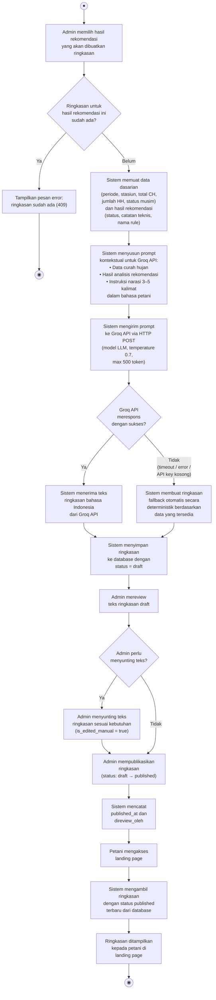

# Activity Diagram — Integrasi AI untuk Ringkasan Rekomendasi Tanam

Dokumen ini menyajikan *activity diagram* yang menggambarkan alur lengkap integrasi AI (Groq API) dalam Sistem Informasi MyFarmer, mulai dari permintaan generate ringkasan oleh admin hingga ringkasan ditampilkan kepada petani di landing page. Dokumen ditujukan untuk keperluan dokumentasi akademik laporan PKL.

Sumber kebenaran implementasi:

- [`GroqService.php`](myfarmer/app/Services/GroqService.php) — Komunikasi dengan Groq API dan penyusunan prompt
- [`RingkasanAiController.php`](myfarmer/app/Http/Controllers/Api/RingkasanAiController.php) — Alur generate, review, dan publish
- [`PublicController.php`](myfarmer/app/Http/Controllers/Api/PublicController.php) — Penyajian ringkasan ke landing page

---

## 1. Diagram



---

## 2. Penjelasan Alur

### 2.1. Tahap Persiapan (Admin → Sistem)

| Langkah | Aktivitas | Penjelasan |
|---------|-----------|------------|
| 1 | **Admin memilih hasil rekomendasi** | Admin memilih satu hasil rekomendasi yang akan dibuatkan ringkasan melalui panel admin. Setiap hasil rekomendasi hanya boleh memiliki satu ringkasan. |
| 2 | **Validasi duplikasi** | Sistem memeriksa apakah ringkasan untuk hasil rekomendasi tersebut sudah ada. Jika sudah ada, sistem menolak permintaan untuk mencegah duplikasi. |
| 3 | **Muat data pendukung** | Sistem memuat data dasarian (periode, stasiun, total curah hujan, jumlah hari hujan, status musim) dan data hasil rekomendasi (status, catatan teknis, nama rule) yang akan digunakan untuk menyusun prompt. |

### 2.2. Tahap Komunikasi dengan AI (Sistem ↔ Groq API)

| Langkah | Aktivitas | Penjelasan |
|---------|-----------|------------|
| 4 | **Penyusunan prompt** | Sistem menyusun prompt terstruktur yang berisi tiga bagian: (a) data curah hujan dalam format yang mudah dibaca, (b) hasil analisis rekomendasi, dan (c) instruksi agar AI menghasilkan ringkasan 3–5 kalimat dalam bahasa sederhana tanpa istilah teknis. AI diberikan persona sebagai "penasihat pertanian padi di Kecamatan Karangploso". |
| 5 | **Pengiriman ke Groq API** | Sistem mengirim prompt ke Groq API melalui HTTP POST. Pengaturan yang digunakan: model LLM yang dikonfigurasi, tingkat kreativitas (*temperature*) sebesar 0,7, batas maksimal 500 token, dan batas waktu koneksi 30 detik. |
| 6a | **Respons sukses** | Jika Groq merespons dengan sukses, sistem mengambil teks ringkasan bahasa Indonesia yang dihasilkan oleh AI. |
| 6b | **Respons gagal → fallback** | Jika terjadi kegagalan (batas waktu terlampaui, koneksi error, API key kosong, atau respons tanpa teks), sistem secara otomatis membuat ringkasan fallback. Ringkasan fallback berisi periode, total curah hujan, dan pesan rekomendasi sederhana, ditandai dengan keterangan bahwa AI sedang tidak tersedia. |

> **Catatan penting:** Groq API **hanya** menarasikan hasil rule engine yang sudah terbentuk. Keputusan rekomendasi (optimal_tanam / tunggu / tidak_disarankan) dibuat sepenuhnya oleh rule engine deterministik, **bukan** oleh AI. AI tidak memiliki wewenang untuk mengubah atau menentukan status rekomendasi.

### 2.3. Tahap Penyimpanan dan Review (Sistem → Admin)

| Langkah | Aktivitas | Penjelasan |
|---------|-----------|------------|
| 7 | **Simpan sebagai draft** | Teks ringkasan (baik dari Groq maupun fallback) disimpan ke database dengan status *draft*. Ringkasan draft **belum** ditampilkan ke publik — hanya terlihat oleh admin. |
| 8 | **Admin mereview draft** | Admin membaca ringkasan yang dihasilkan AI melalui panel admin dan menilai apakah teks sudah sesuai untuk ditampilkan ke petani. |
| 9 | **Penyuntingan (opsional)** | Jika teks perlu diperbaiki, admin dapat menyunting langsung. Sistem secara otomatis menandai bahwa ringkasan telah disunting secara manual untuk membedakan dari hasil asli AI. |
| 10 | **Publikasi** | Admin mengubah status ringkasan menjadi *published*. Sistem mencatat waktu publikasi dan identitas admin yang mereview untuk keperluan akuntabilitas. |

### 2.4. Tahap Penyajian ke Petani (Sistem → Petani)

| Langkah | Aktivitas | Penjelasan |
|---------|-----------|------------|
| 11 | **Petani mengakses landing page** | Petani membuka halaman utama MyFarmer tanpa perlu login atau membuat akun. |
| 12 | **Sistem mengambil ringkasan terbaru** | Sistem mengambil ringkasan dengan status *published* yang paling baru. Ringkasan yang masih berstatus *draft* tidak pernah ditampilkan ke publik. |
| 13 | **Ringkasan ditampilkan** | Teks ringkasan bahasa Indonesia ditampilkan kepada petani beserta informasi konteks seperti periode, stasiun, dan status rekomendasi tanam. |

---

## 3. Aktor yang Terlibat

| No. | Aktor | Jenis | Peran dalam Alur |
|-----|-------|-------|------------------|
| 1 | **Admin** | Primer | Memulai proses generate, mereview dan menyunting draft, mempublikasikan ringkasan |
| 2 | **Groq API (LLM)** | Sekunder (Sistem Eksternal) | Menerima prompt dan menghasilkan teks ringkasan bahasa Indonesia |
| 3 | **Petani / Publik** | Primer | Mengonsumsi ringkasan yang sudah dipublikasikan melalui landing page |

---

## 4. Mekanisme Fallback

Sistem dirancang untuk tetap berfungsi meskipun Groq API tidak tersedia. Tabel berikut menunjukkan kondisi kegagalan yang ditangani:

| Kondisi Kegagalan | Penanganan | Hasil |
|--------------------|-----------|-------|
| `GROQ_API_KEY` tidak dikonfigurasi di `.env` | Langsung gunakan fallback | Ringkasan deterministik |
| Timeout koneksi (> 30 detik) | `ConnectException` ditangkap | Ringkasan fallback + log error |
| Client error (4xx) dari Groq | `ClientException` ditangkap | Ringkasan fallback + log error |
| Server error (5xx) dari Groq | `ServerException` ditangkap | Ringkasan fallback + log error |
| Respons Groq tidak mengandung teks | Validasi `choices[0].message.content` | Ringkasan fallback + log warning |
| Error tidak terduga | `\Exception` umum ditangkap | Ringkasan fallback + log error |

Ringkasan fallback mengikuti format:

```
[Ringkasan otomatis - AI sedang tidak tersedia] Pada periode dasarian {N} bulan 
{nama_bulan} {tahun}, total curah hujan tercatat {X} mm. {Pesan rekomendasi sesuai status}.
```

---

## 5. Struktur Prompt yang Dikirim ke Groq API

Prompt yang dikirim terdiri dari dua pesan (*messages*):

### 5.1. System Prompt (Persona)

```
Kamu adalah penasihat pertanian padi yang membantu petani di Kecamatan 
Karangploso, Kabupaten Malang, Jawa Timur. Gunakan Bahasa Indonesia yang 
sederhana, hangat, dan mudah dipahami petani.
```

### 5.2. User Prompt (Data + Instruksi)

```
=== DATA CURAH HUJAN ===
- Periode: Dasarian {N} bulan {nama_bulan} {tahun}
- Stasiun: {nama_stasiun}
- Total curah hujan: {X} mm
- Jumlah hari hujan: {Y} hari
- Jumlah hari data valid: {Z} hari
- Kondisi musim: {status_musim}

=== HASIL ANALISIS REKOMENDASI ===
- Rule yang digunakan: {nama_rule}
- Kesimpulan: {status dalam bahasa awam}
- Detail teknis: {catatan_teknis}

=== INSTRUKSI ===
Buatlah ringkasan singkat 3-5 kalimat dalam Bahasa Indonesia yang:
1. Menjelaskan kondisi curah hujan saat ini dengan bahasa sederhana.
2. Memberikan rekomendasi tanam padi berdasarkan kesimpulan di atas.
3. Tidak memakai istilah teknis seperti dasarian, threshold, agregasi, atau rule engine.
4. Terdengar hangat dan mendukung, seperti bicara langsung ke petani.
```

Status rekomendasi diterjemahkan ke bahasa awam sebelum dikirim ke Groq:

| Status Teknis | Terjemahan untuk Prompt |
|---------------|------------------------|
| `optimal_tanam` | waktu yang baik untuk menanam |
| `tunggu` | belum waktunya menanam, masih menunggu |
| `tidak_disarankan` | belum disarankan untuk menanam |

---

## 6. Siklus Hidup Ringkasan AI

```
Generate (via Groq API / fallback)
    ↓
  Draft  ←──── Admin menyunting (opsional)
    ↓
Published ───→ Ditampilkan di landing page petani
```

| Status | Terlihat oleh Admin | Terlihat oleh Petani | Keterangan |
|--------|:---:|:---:|------------|
| `draft` | ✓ | ✗ | Baru dihasilkan, menunggu review admin |
| `published` | ✓ | ✓ | Sudah disetujui admin, ditampilkan di landing page |

---

## 7. Referensi

- Groq API Documentation. *Chat Completions API*. https://console.groq.com/docs/api-reference/chat/create
- Laravel Documentation. *Eloquent ORM*. https://laravel.com/docs/10.x/eloquent

---

*Dokumen ini disusun berdasarkan implementasi MyFarmer. Lihat [RULE_BASE.md](RULE_BASE.md) untuk landasan akademis rule base, [diagram_arsitektur_sistem.md](diagram_arsitektur_sistem.md) untuk arsitektur teknis sistem, dan [API_DOCUMENTATION.md](API_DOCUMENTATION.md) untuk kontrak endpoint.*
