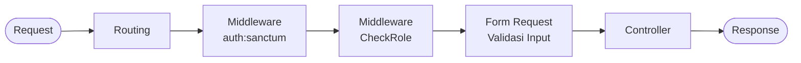

# Diagram Alur Permintaan pada Backend

Diagram berikut menggambarkan alur pemrosesan permintaan pada backend, mulai dari permintaan diterima hingga respons dikembalikan kepada klien.

## Keterangan

1. **Request** — Klien mengirimkan permintaan HTTP ke backend.
2. **Routing** — Laravel mencocokkan URL dan metode HTTP dengan route yang sesuai.
3. **auth:sanctum** — Middleware memeriksa token dan memastikan pengguna telah terautentikasi.
4. **CheckRole** — Middleware memeriksa apakah pengguna memiliki peran yang diizinkan.
5. **Form Request** — Data masukan divalidasi sebelum diteruskan ke controller.
6. **Controller** — Controller menjalankan proses sesuai kebutuhan endpoint.
7. **Response** — Backend mengembalikan respons kepada klien.
