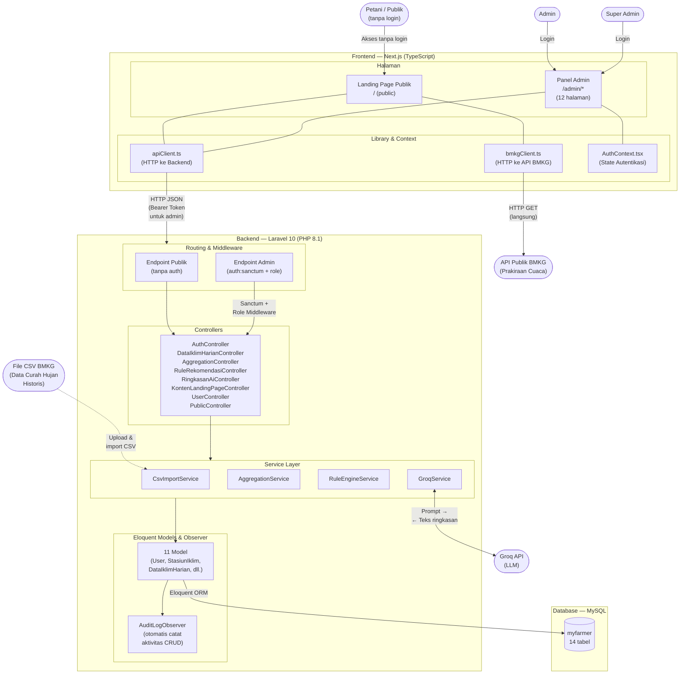
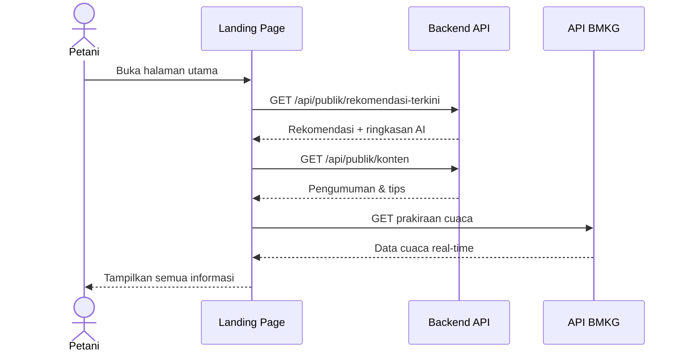

# Diagram Arsitektur Sistem MyFarmer

Dokumen ini menyajikan arsitektur Sistem Informasi MyFarmer secara keseluruhan dalam satu diagram untuk keperluan dokumentasi akademik laporan PKL.

Sumber kebenaran implementasi:

- `myfarmer/` — Backend REST API (Laravel 10, PHP 8.1)
- `myfarmer_frontd/` — Frontend (Next.js, TypeScript)
- `myfarmer/routes/api.php` — Definisi endpoint API
- `myfarmer/app/Services/` — Service layer (CsvImport, Aggregation, RuleEngine, Groq)

---

## 1. Diagram Arsitektur

---

## 2. Penjelasan Arsitektur

Arsitektur Sistem Informasi MyFarmer menggunakan pola *client-server* dengan pemisahan antara frontend dan backend yang berkomunikasi melalui REST API. Sistem terdiri dari lima lapisan utama: **Pengguna**, **Frontend**, **Backend**, **Database**, dan **Layanan Eksternal**.

### 2.1. Pengguna

Sistem melayani tiga jenis pengguna dengan tingkat akses yang berbeda:

| Pengguna | Akses | Autentikasi |
|----------|-------|-------------|
| **Petani / Publik** | Landing page: grafik curah hujan, rekomendasi tanam, ringkasan AI, prakiraan cuaca, dan konten edukasi | Tidak perlu login |
| **Admin** | Panel admin: kelola data iklim, proses agregasi, evaluasi rule engine, generate ringkasan AI, dan kelola konten | Login via Laravel Sanctum (Bearer Token) |
| **Super Admin** | Seluruh akses admin + kelola akun admin, CRUD rule rekomendasi, dan lihat audit log | Login via Laravel Sanctum (Bearer Token) |

Super Admin merupakan spesialisasi dari Admin — mewarisi seluruh hak akses Admin ditambah kewenangan eksklusif.

### 2.2. Frontend — Next.js (TypeScript)

Frontend dibangun menggunakan **Next.js App Router** dan terdiri dari dua kelompok halaman serta tiga library pendukung.

| Komponen | Fungsi | Relasi |
|----------|--------|--------|
| **Landing Page** (`/(public)/`) | Halaman publik untuk petani yang menampilkan rekomendasi tanam, grafik curah hujan, ringkasan AI, prakiraan cuaca, dan konten edukasi | Mengakses backend via `apiClient.ts` untuk data rekomendasi; mengakses API BMKG via `bmkgClient.ts` untuk prakiraan cuaca |
| **Panel Admin** (`/admin/*`, 12 halaman) | Antarmuka bagi admin untuk mengelola seluruh pipeline data: data iklim, agregasi, rule, rekomendasi, ringkasan AI, konten, user, dan log | Mengakses backend via `apiClient.ts` dengan Bearer Token; menggunakan `AuthContext.tsx` untuk state autentikasi |
| **apiClient.ts** | HTTP client ke backend Laravel | Menyertakan header `Authorization: Bearer {token}` secara otomatis pada setiap permintaan ke endpoint admin |
| **bmkgClient.ts** | HTTP client ke API publik BMKG | Mengambil prakiraan cuaca **langsung** dari `api.bmkg.go.id` tanpa melalui backend — data prakiraan tidak disimpan di database |
| **AuthContext.tsx** | React Context untuk state autentikasi | Menyimpan token Sanctum dan informasi user yang sedang login |

### 2.3. Backend — Laravel 10 (PHP 8.1)

Backend menggunakan arsitektur berlapis (*layered architecture*) dengan empat lapisan: **Routing & Middleware**, **Controllers**, **Service Layer**, dan **Models & Observer**.

#### Routing & Middleware

Endpoint API dibagi menjadi dua kelompok berdasarkan autentikasi:

| Kelompok | Middleware | Contoh Endpoint |
|----------|-----------|-----------------|
| **Endpoint Publik** | Tanpa middleware auth | `GET /api/publik/rekomendasi-terkini`, `GET /api/publik/konten` |
| **Endpoint Admin** | `auth:sanctum` + `role:admin` atau `role:super_admin` | `POST /api/admin/data-iklim/import`, `POST /api/admin/rekomendasi/evaluasi` |

Endpoint publik dapat diakses langsung oleh frontend tanpa token. Endpoint admin memerlukan token Sanctum yang valid dan peran (*role*) yang sesuai.

#### Controllers

Delapan controller menangani logika routing ke service layer. Controller tidak memuat logika bisnis — hanya menerima request, memvalidasi input, memanggil service, dan mengembalikan response JSON standar `{status, message, data}`.

#### Service Layer

Empat service inti memproses logika bisnis utama:

| Service | Fungsi | Input | Output |
|---------|--------|-------|--------|
| **CsvImportService** | Mengimpor file CSV dari portal Data Online BMKG (`dataonline.bmkg.go.id`). Menangani kode khusus: `8888` (tidak terukur) dan `9999` (tidak ada data). | File CSV curah hujan harian | Record di `data_iklim_harian` + log di `log_import_data` |
| **AggregationService** | Mengagregasi data harian menjadi data per dasarian (periode 10 hari). Menghitung total curah hujan, jumlah hari hujan (CH ≥ 0,5 mm), dan status musim. | Data dari `data_iklim_harian` | Record di `data_iklim_dasarian` |
| **RuleEngineService** | Mengevaluasi data dasarian terhadap rule rekomendasi secara deterministik menggunakan kriteria curah hujan dan hari hujan yang tersimpan dalam parameter JSON. | Data dari `data_iklim_dasarian` + parameter dari `rule_rekomendasi` | Record di `hasil_rekomendasi` dengan status: `optimal_tanam`, `tunggu`, atau `tidak_disarankan` |
| **GroqService** | Mengirim data dasarian dan hasil rekomendasi ke Groq API untuk menghasilkan ringkasan bahasa Indonesia yang mudah dipahami petani. Menyediakan mekanisme fallback jika API tidak tersedia. | Data dari `data_iklim_dasarian` + `hasil_rekomendasi` | Record di `ringkasan_ai` (status: `draft`) |

#### Models & Observer

Sebelas model Eloquent merepresentasikan 14 tabel database (beberapa model menangani tabel bawaan Laravel). **AuditLogObserver** terpasang pada empat model (`DataIklimHarian`, `RuleRekomendasi`, `KontenLandingPage`, `RingkasanAi`) dan secara otomatis mencatat setiap aktivitas `created`, `updated`, dan `deleted` ke tabel `audit_log`.

### 2.4. Database — MySQL

Database `myfarmer` terdiri dari 14 tabel yang dikelompokkan dalam tiga kategori:

| Kategori | Tabel | Jumlah |
|----------|-------|--------|
| **Inti Proyek** | `roles`, `users`, `stasiun_iklim`, `data_iklim_harian`, `data_iklim_dasarian`, `rule_rekomendasi`, `hasil_rekomendasi`, `ringkasan_ai`, `konten_landing_page` | 9 |
| **Logging & Audit** | `log_import_data`, `audit_log` | 2 |
| **Bawaan Laravel** | `personal_access_tokens`, `password_reset_tokens`, `failed_jobs` | 3 |

> Untuk detail skema, relasi, dan ERD database, lihat [diagram_erd_myfarmer.md](diagram_erd_myfarmer.md).

### 2.5. Layanan Eksternal

Sistem mengintegrasikan tiga layanan eksternal:

| Layanan | Fungsi | Diakses Oleh | Metode Akses |
|---------|--------|--------------|--------------|
| **API Publik BMKG** (`api.bmkg.go.id`) | Menyediakan prakiraan cuaca real-time untuk ditampilkan di landing page dan panel admin | Frontend (`bmkgClient.ts`) | HTTP GET langsung — backend **tidak** menyimpan atau memproses data prakiraan |
| **Groq API** | Menghasilkan ringkasan rekomendasi tanam dalam bahasa Indonesia menggunakan *large language model* | Backend (`GroqService`) | HTTP POST dengan API key — disertai mekanisme fallback otomatis jika API gagal |
| **Portal Data Online BMKG** (`dataonline.bmkg.go.id`) | Sumber file CSV data curah hujan historis | Admin (upload manual ke backend) | File CSV diunduh manual oleh admin, lalu diimpor melalui endpoint `POST /api/admin/data-iklim/import` |

---

## 3. Alur Interaksi Petani (Publik)

Petani mengakses landing page tanpa perlu login. Frontend memuat data dari dua sumber secara paralel: (1) backend MyFarmer untuk rekomendasi tanam, ringkasan AI, grafik curah hujan, dan konten edukasi; (2) API publik BMKG untuk prakiraan cuaca real-time. Seluruh informasi disajikan dalam satu halaman yang mudah dipahami.

> **Catatan:** Untuk alur kerja admin (pipeline data dan integrasi AI), lihat dokumen berikut:
> - [Data Flow Diagram — 3-Layer Model](dfd_tiga_layer_data.md) — alur data dari raw → agregasi dasarian → rule engine → output rekomendasi.
> - [Activity Diagram — Integrasi AI](activity_diagram_integrasi_AI.md) — alur permintaan ke Groq API sampai ringkasan ditampilkan ke petani.

---

## 4. Teknologi yang Digunakan

| Lapisan | Teknologi | Versi |
|---------|-----------|-------|
| Frontend | Next.js (TypeScript) | — |
| Styling | CSS | — |
| Backend | Laravel (PHP) | 10.50.2 (PHP 8.1) |
| Database | MySQL | — |
| Autentikasi | Laravel Sanctum | — |
| AI / LLM | Groq API | — |
| Data Eksternal | API Publik BMKG | — |

---

*Dokumen ini disusun berdasarkan implementasi MyFarmer. Lihat [README.md](README.md) untuk panduan menjalankan proyek, [API_DOCUMENTATION.md](API_DOCUMENTATION.md) untuk kontrak endpoint, dan [diagram_erd_myfarmer.md](diagram_erd_myfarmer.md) untuk skema database lengkap.*
