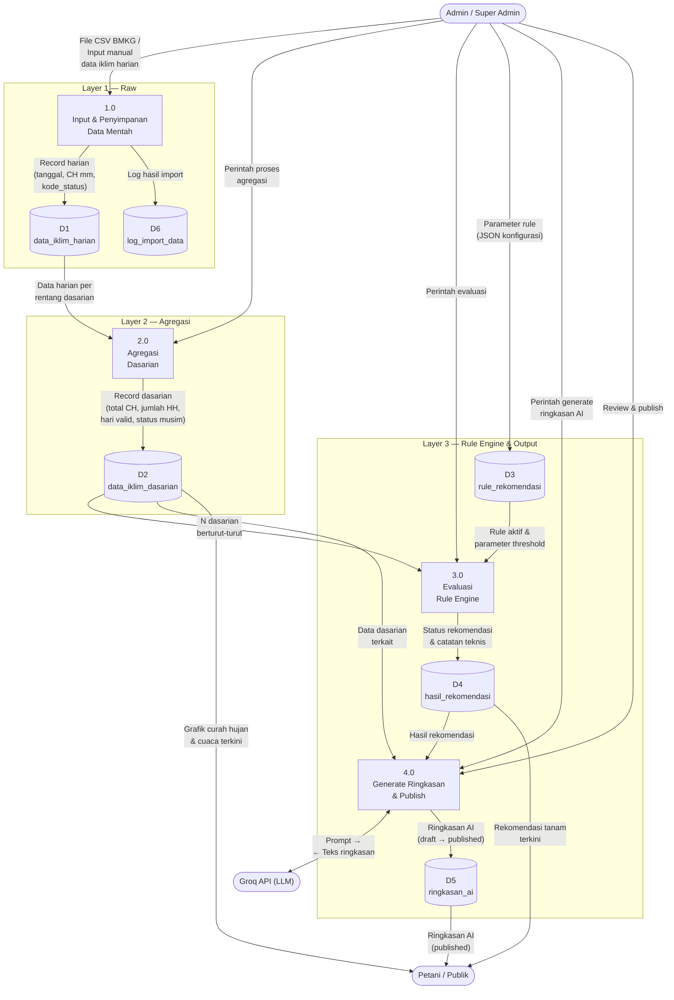

# Data Flow Diagram (DFD) — 3-Layer Model Sistem MyFarmer

Dokumen ini menyajikan *Data Flow Diagram* (DFD) yang menggambarkan alur transformasi data dalam Sistem Informasi MyFarmer, mulai dari data mentah curah hujan hingga output rekomendasi tanam. Diagram menggunakan model tiga lapis (*three-layer*): **Raw → Agregasi Dasarian → Rule Engine → Output Rekomendasi**. Dokumen ditujukan untuk keperluan dokumentasi akademik laporan PKL.

Sumber kebenaran implementasi:

- [`CsvImportService.php`](myfarmer/app/Services/CsvImportService.php) — Layer 1 (Input & Raw)
- [`AggregationService.php`](myfarmer/app/Services/AggregationService.php) — Layer 2 (Agregasi Dasarian)
- [`RuleEngineService.php`](myfarmer/app/Services/RuleEngineService.php) — Layer 3 (Rule Engine)
- [`GroqService.php`](myfarmer/app/Services/GroqService.php) — Output Rekomendasi
- [`PublicController.php`](myfarmer/app/Http/Controllers/Api/PublicController.php) — Endpoint publik landing page

---

## 1. Diagram



---

## 2. Penjelasan Entitas Eksternal

| No. | Entitas Eksternal | Peran | Jenis Aliran |
|-----|-------------------|-------|--------------|
| 1 | **Admin / Super Admin** | Menginput data, memproses pipeline (agregasi, evaluasi rule, generate ringkasan), dan mempublikasikan rekomendasi ke landing page. File CSV diunduh manual dari Portal Data Online BMKG (`dataonline.bmkg.go.id`). | Masuk dan keluar |
| 2 | **Petani / Publik** | Mengonsumsi informasi rekomendasi tanam, grafik curah hujan, dan ringkasan AI melalui landing page tanpa login. | Keluar saja |
| 3 | **Groq API (LLM)** | Menerima data dasarian dan hasil rekomendasi, menghasilkan ringkasan 3–5 kalimat dalam bahasa Indonesia yang mudah dipahami petani. Groq **tidak** membuat keputusan rekomendasi — hanya menarasikan hasil rule engine deterministik. | Masuk dan keluar |

---

## 3. Penjelasan Proses

### 3.1. Proses 1.0 — Input & Penyimpanan Data Mentah (Layer 1: Raw)

Proses ini menerima data curah hujan harian dari dua sumber:

- **Import CSV BMKG**: File CSV dari portal `dataonline.bmkg.go.id` dengan delimiter titik koma (`;`) dan desimal koma. Kode khusus BMKG ditangani: `8888` (tidak terukur) dan `9999` (tidak ada data) disimpan dengan `curah_hujan_mm = null` dan kode status yang sesuai.
- **Input manual admin**: Data dimasukkan melalui form pada panel admin.

Data disimpan ke tabel `data_iklim_harian` menggunakan mekanisme *upsert* (`updateOrCreate`) berdasarkan *unique constraint* `(stasiun_id, tanggal)`, sehingga tidak terjadi duplikasi. Setiap proses import dicatat ke `log_import_data` dengan status, jumlah data masuk, dan pesan error.

| Implementasi | File |
|-------------|------|
| Service import CSV | [`CsvImportService.php`](myfarmer/app/Services/CsvImportService.php) |
| Controller CRUD & import | [`DataIklimHarianController.php`](myfarmer/app/Http/Controllers/Api/DataIklimHarianController.php) |

### 3.2. Proses 2.0 — Agregasi Dasarian (Layer 2: Agregasi)

Proses ini **membaca** data harian dari `data_iklim_harian` (tanpa mengubah atau menghapus data mentah) dan menghitung metrik agregasi per periode dasarian:

| Metrik | Rumus | Keterangan |
|--------|-------|------------|
| `total_curah_hujan_mm` | Σ CH dari data dengan `kode_status = normal` | Akumulasi curah hujan (mm) |
| `jumlah_hari_hujan` | Jumlah hari valid dengan CH ≥ 0,5 mm | Definisi hari hujan mengikuti Ulfah & Sulistya (2015) |
| `jumlah_hari_valid` | Jumlah record `kode_status = normal` | Indikator kelengkapan data |
| `jumlah_hari_missing` | Jumlah record status ≠ `normal` | Termasuk `tidak_terukur` dan `tidak_ada_data` |
| `status_musim` | `basah` (≥ 150 mm), `normal` (50–149 mm), `kering` (< 50 mm) | Klasifikasi terpisah dari rule rekomendasi |

Periode dasarian: **Dasarian I** (tanggal 1–10), **Dasarian II** (tanggal 11–20), **Dasarian III** (tanggal 21–akhir bulan). Hasil disimpan ke `data_iklim_dasarian` dengan *upsert* pada `(stasiun_id, tahun, bulan, dasarian_ke)`.

| Implementasi | File |
|-------------|------|
| Service agregasi | [`AggregationService.php`](myfarmer/app/Services/AggregationService.php) |
| Controller | [`AggregationController.php`](myfarmer/app/Http/Controllers/Api/AggregationController.php) |

### 3.3. Proses 3.0 — Evaluasi Rule Engine (Layer 3: Rule Engine)

Proses ini membaca `N` dasarian berturut-turut (default: 3) yang berakhir pada dasarian target, lalu mengevaluasi setiap rule aktif menggunakan tiga kriteria:

1. **Kriteria utama**: Seluruh `N` dasarian memiliki CH ≥ `min_curah_hujan_dasarian`.
2. **Kriteria alternatif**: Hanya diperiksa jika kriteria utama gagal; total CH jendela harus ≥ `total_alternatif_mm`.
3. **Kriteria hari hujan** (opsional): Jika toggle aktif, seluruh dasarian harus memiliki HH ≥ `min_hari_hujan_dasarian`.

Hasil evaluasi berupa status rekomendasi:

| Status | Kondisi |
|--------|---------|
| `optimal_tanam` | Kriteria CH (utama/alternatif) terpenuhi DAN kriteria HH terpenuhi atau dinonaktifkan |
| `tunggu` | Data belum cukup, atau CH terpenuhi tapi HH gagal, atau dasarian terkini ≥ minimum tapi jendela belum lengkap |
| `tidak_disarankan` | CH dasarian terkini di bawah minimum dan kriteria alternatif tidak terpenuhi |

Parameter rule disimpan dalam kolom JSON `rule_rekomendasi.parameter` agar dapat dikonfigurasi tanpa mengubah kode. Hasil evaluasi disimpan ke `hasil_rekomendasi` dengan catatan teknis kronologis untuk audit.

| Implementasi | File |
|-------------|------|
| Service rule engine | [`RuleEngineService.php`](myfarmer/app/Services/RuleEngineService.php) |
| Controller | [`RuleRekomendasiController.php`](myfarmer/app/Http/Controllers/Api/RuleRekomendasiController.php) |

### 3.4. Proses 4.0 — Generate Ringkasan & Publish (Layer 3: Output)

Proses ini mengirim data dasarian dan hasil rekomendasi ke Groq API dalam bentuk prompt terstruktur. Groq menghasilkan ringkasan 3–5 kalimat dalam bahasa Indonesia. Jika API gagal, sistem menggunakan **ringkasan fallback** deterministik.

Ringkasan disimpan dengan status `draft` dan baru ditampilkan ke petani setelah admin mereview dan mengubah status menjadi `published`. Siklus hidup ringkasan:

```
Generate (Groq API) → Draft → Review Admin → Published → Tampil di Landing Page
```

Endpoint publik yang menyajikan data ke petani:

| Endpoint | Data yang Disajikan |
|----------|---------------------|
| `GET /api/publik/grafik-curah-hujan` | Histori curah hujan dasarian + overlay status rekomendasi |
| `GET /api/publik/cuaca-terkini` | Data dasarian paling baru (total CH, hari hujan, status musim) |
| `GET /api/publik/rekomendasi-terkini` | Hasil rekomendasi terbaru (status dan catatan teknis) |
| `GET /api/publik/ringkasan-terkini` | Ringkasan AI published terbaru |
| `GET /api/publik/konten` | Konten landing page aktif (pengumuman, tips) |

| Implementasi | File |
|-------------|------|
| Service Groq | [`GroqService.php`](myfarmer/app/Services/GroqService.php) |
| Controller ringkasan | [`RingkasanAiController.php`](myfarmer/app/Http/Controllers/Api/RingkasanAiController.php) |
| Controller publik | [`PublicController.php`](myfarmer/app/Http/Controllers/Api/PublicController.php) |

---

## 4. Penjelasan Data Store

| Kode | Nama Tabel | Layer | Deskripsi |
|------|-----------|-------|-----------|
| D1 | `data_iklim_harian` | Raw | Data mentah curah hujan harian per stasiun per tanggal, termasuk kode status (normal / tidak_terukur / tidak_ada_data) dan sumber data (manual / import_csv). |
| D2 | `data_iklim_dasarian` | Agregasi | Hasil agregasi per periode 10 hari: total CH, jumlah hari hujan, hari valid/missing, dan status musim. |
| D3 | `rule_rekomendasi` | Rule Engine | Konfigurasi rule rekomendasi tanam dengan parameter JSON berisi lima threshold. |
| D4 | `hasil_rekomendasi` | Rule Engine | Hasil evaluasi rule engine: status rekomendasi dan catatan teknis naratif per pasangan (dasarian, rule). |
| D5 | `ringkasan_ai` | Output | Ringkasan bahasa Indonesia dari Groq AI. Memiliki siklus hidup draft → published. |
| D6 | `log_import_data` | Raw | Log historis proses import CSV: status, jumlah data, pesan error, waktu eksekusi. |

---

## 5. Ringkasan Aliran Data End-to-End

| Tahap | Layer | Input | Transformasi | Output |
|-------|-------|-------|--------------|--------|
| 1 | **Raw** | File CSV BMKG / input manual | Parsing, validasi, konversi kode BMKG (8888/9999), upsert | `data_iklim_harian` |
| 2 | **Agregasi** | Data harian per rentang dasarian | Penjumlahan CH, penghitungan HH (CH ≥ 0,5 mm), klasifikasi musim | `data_iklim_dasarian` |
| 3 | **Rule Engine** | N dasarian berturut-turut + parameter rule | Evaluasi kriteria utama, alternatif, dan HH secara deterministik | `hasil_rekomendasi` |
| 4 | **Output** | Hasil rekomendasi + data dasarian | Narasi oleh Groq AI → draft → review admin → publish | `ringkasan_ai` → Landing Page Petani |

---

## 6. Keterangan Notasi

Diagram menggunakan notasi DFD Gane-Sarson yang disesuaikan dengan rendering Mermaid:

| Simbol | Representasi | Keterangan |
|--------|-------------|------------|
| Entitas Eksternal | `(["nama"])` — stadium shape | Sumber atau tujuan data di luar batas sistem |
| Proses | `["nomor nama"]` — rectangle | Transformasi data, diberi nomor hierarkis |
| Data Store | `[("nama")]` — cylindrical shape | Tempat penyimpanan data (tabel database) |
| Aliran Data | Panah berarah dengan label | Perpindahan data antar komponen |

---

## 7. Referensi

- Ulfah, A., & Sulistya, W. (2015). Penentuan kriteria awal musim alternatif di wilayah Jawa Timur. *Jurnal Meteorologi dan Geofisika, 16*(3), 145–153.
- Surmaini, E., & Syahbuddin, H. (2016). Kriteria awal musim tanam: Tinjauan prediksi waktu tanam padi di Indonesia. *Jurnal Penelitian dan Pengembangan Pertanian, 35*(2), 47–56.
- Gane, C., & Sarson, T. (1979). *Structured Systems Analysis: Tools and Techniques*. Prentice-Hall.

---

*Dokumen ini disusun berdasarkan implementasi MyFarmer. Lihat [RULE_BASE.md](RULE_BASE.md) untuk landasan akademis rule base, [API_DOCUMENTATION.md](API_DOCUMENTATION.md) untuk kontrak endpoint, dan [diagram_arsitektur_sistem.md](diagram_arsitektur_sistem.md) untuk arsitektur teknis sistem.*
