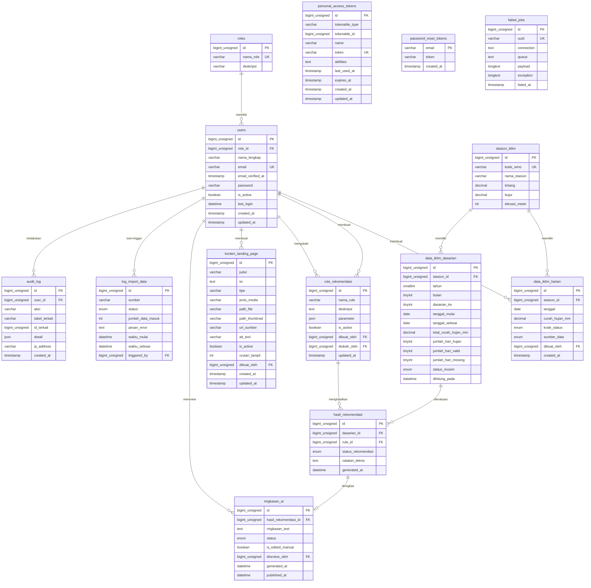

# Dokumentasi Database — MyFarmer

**Sistem Informasi Curah Hujan Berbasis Artificial Intelligence untuk Optimalisasi Tanam Padi di Wilayah Kec. Karangploso**

| Informasi | Detail |
|---|---|
| **Nama Proyek** | MyFarmer |
| **Nama Database** | `myfarmer` |
| **DBMS** | MySQL |
| **Framework** | Laravel v10.50.2 |
| **PHP Version** | 8.1.10 |
| **Tanggal Dokumentasi** | 29 Juli 2026 |

---

## 1. Ringkasan Umum Database

Database `myfarmer` dirancang untuk mendukung sistem informasi curah hujan berbasis AI yang bertujuan membantu petani padi di wilayah Kecamatan Karangploso, Kabupaten Malang, Jawa Timur dalam menentukan waktu tanam yang optimal. Sistem ini merupakan proyek Praktik Kerja Lapangan (PKL) di BMKG Jawa Timur.

### Arsitektur Data

Database menerapkan arsitektur data berlapis (*layered data architecture*) dengan alur sebagai berikut:

```
Raw Layer          →  Aggregated Layer      →  Rule Engine         →  AI Summary
(data_iklim_harian)   (data_iklim_dasarian)    (hasil_rekomendasi)    (ringkasan_ai)
```

1. **Raw Layer** — Data curah hujan harian dari stasiun BMKG, diinput secara manual atau melalui import file CSV
2. **Aggregated Layer** — Hasil agregasi data harian per periode dasarian (10 hari)
3. **Rule Engine Layer** — Evaluasi rule rekomendasi terhadap data dasarian untuk menghasilkan rekomendasi tanam
4. **AI Summary Layer** — Ringkasan berbahasa Indonesia yang dihasilkan oleh Groq API berdasarkan hasil rekomendasi

Selain itu, terdapat tabel pendukung untuk manajemen pengguna, konten landing page, pencatatan log, dan audit trail. Prakiraan cuaca real-time diambil langsung oleh frontend dari API publik BMKG dan tidak disimpan di database backend.

### Jumlah Tabel

Database terdiri dari **14 tabel**, dengan rincian:

| Kategori | Tabel | Jumlah |
|---|---|---|
| **Inti Proyek** | `roles`, `users`, `stasiun_iklim`, `data_iklim_harian`, `data_iklim_dasarian`, `rule_rekomendasi`, `hasil_rekomendasi`, `ringkasan_ai`, `konten_landing_page` | 9 |
| **Logging & Audit** | `log_import_data`, `audit_log` | 2 |
| **Bawaan Laravel** | `personal_access_tokens`, `password_reset_tokens`, `failed_jobs` | 3 |

---

## 2. Daftar Tabel

| No | Nama Tabel | Fungsi | Kategori |
|----|---|---|---|
| 1 | `roles` | Menyimpan daftar role pengguna (`admin`, `super_admin`) | Manajemen Pengguna |
| 2 | `users` | Akun administrator dan super administrator sistem | Manajemen Pengguna |
| 3 | `personal_access_tokens` | Token autentikasi API (Laravel Sanctum) | Autentikasi |
| 4 | `password_reset_tokens` | Token reset password (bawaan Laravel, tidak aktif digunakan) | Autentikasi |
| 5 | `failed_jobs` | Pencatatan queue job yang gagal (bawaan Laravel) | Sistem |
| 6 | `stasiun_iklim` | Metadata stasiun pengamatan iklim BMKG | Data Iklim |
| 7 | `data_iklim_harian` | Data curah hujan harian (*raw layer*) | Data Iklim |
| 8 | `data_iklim_dasarian` | Data curah hujan agregasi per dasarian (*aggregated layer*) | Data Iklim |
| 9 | `rule_rekomendasi` | Definisi rule beserta parameter threshold | Rule Engine |
| 10 | `hasil_rekomendasi` | Output evaluasi rule engine per periode dasarian | Rule Engine |
| 11 | `ringkasan_ai` | Ringkasan kondisi iklim dari Groq API | AI Summary |
| 12 | `konten_landing_page` | Konten teks dan media (sorotan, poster, PDF) untuk landing page | Konten |
| 13 | `log_import_data` | Log proses import data dari file CSV BMKG | Logging |
| 14 | `audit_log` | Jejak aktivitas admin untuk keperluan audit | Audit |

---

## 3. Penjelasan Detail Setiap Tabel

### 3.1. Tabel `roles`

**Fungsi:** Menyimpan daftar role (peran) pengguna dalam sistem. Sistem menggunakan dua role: `admin` dan `super_admin`.

| No | Kolom | Tipe Data | Constraint | Nullable | Default | Keterangan |
|----|---|---|---|---|---|---|
| 1 | `id` | `bigint unsigned` | PRIMARY KEY, AUTO_INCREMENT | Tidak | — | Identifier unik |
| 2 | `nama_role` | `varchar(255)` | UNIQUE | Tidak | — | Nama role (contoh: `admin`, `super_admin`) |
| 3 | `deskripsi` | `varchar(255)` | — | Ya | `NULL` | Deskripsi singkat fungsi role |

- **Primary Key:** `id`
- **Unique Index:** `nama_role`
- **Timestamps:** Tidak ada (`$timestamps = false`)
- **Soft Delete:** Tidak digunakan

---

### 3.2. Tabel `users`

**Fungsi:** Menyimpan data akun administrator dan super administrator. Petani tidak memiliki akun dalam sistem — mereka mengakses landing page tanpa login.

> **Catatan:** Tabel ini dibuat oleh migration bawaan Laravel, kemudian dimodifikasi oleh migration `modify_users_table_add_role_and_profile` yang menambahkan kolom `role_id`, `nama_lengkap`, `is_active`, `last_login`, serta menghapus kolom `name` dan `remember_token`.

| No | Kolom | Tipe Data | Constraint | Nullable | Default | Keterangan |
|----|---|---|---|---|---|---|
| 1 | `id` | `bigint unsigned` | PRIMARY KEY, AUTO_INCREMENT | Tidak | — | Identifier unik |
| 2 | `role_id` | `bigint unsigned` | FOREIGN KEY → `roles.id` (ON DELETE RESTRICT) | Tidak | — | Role pengguna |
| 3 | `nama_lengkap` | `varchar(255)` | — | Tidak | — | Nama lengkap pengguna |
| 4 | `email` | `varchar(255)` | UNIQUE | Tidak | — | Alamat email (digunakan untuk login) |
| 5 | `email_verified_at` | `timestamp` | — | Ya | `NULL` | Waktu verifikasi email (bawaan Laravel, tidak aktif digunakan) |
| 6 | `password` | `varchar(255)` | — | Tidak | — | Password ter-hash (menggunakan cast `hashed`) |
| 7 | `is_active` | `tinyint(1)` | — | Tidak | `true` | Status aktif akun |
| 8 | `last_login` | `datetime` | — | Ya | `NULL` | Waktu login terakhir |
| 9 | `created_at` | `timestamp` | — | Ya | `NULL` | Waktu pembuatan record |
| 10 | `updated_at` | `timestamp` | — | Ya | `NULL` | Waktu pembaruan terakhir |

- **Primary Key:** `id`
- **Foreign Key:** `role_id` → `roles.id` (ON DELETE RESTRICT — role tidak bisa dihapus selama masih ada user yang memakainya)
- **Unique Index:** `email`
- **Timestamps:** `created_at`, `updated_at` (standar Laravel)
- **Soft Delete:** Tidak digunakan (nonaktif via `is_active = false`)
- **Cast di Model:**
  - `email_verified_at` → `datetime`
  - `password` → `hashed` (otomatis hash saat set)
  - `is_active` → `boolean`
  - `last_login` → `datetime`
- **Hidden di Model:** `password`

---

### 3.3. Tabel `personal_access_tokens`

**Fungsi:** Menyimpan token autentikasi API yang dikelola oleh Laravel Sanctum. Setiap kali user login, sebuah token baru dibuat dan disimpan di tabel ini.

| No | Kolom | Tipe Data | Constraint | Nullable | Default | Keterangan |
|----|---|---|---|---|---|---|
| 1 | `id` | `bigint unsigned` | PRIMARY KEY, AUTO_INCREMENT | Tidak | — | Identifier unik |
| 2 | `tokenable_type` | `varchar(255)` | INDEX (morphs) | Tidak | — | Tipe model pemilik token (polimorfik) |
| 3 | `tokenable_id` | `bigint unsigned` | INDEX (morphs) | Tidak | — | ID model pemilik token (polimorfik) |
| 4 | `name` | `varchar(255)` | — | Tidak | — | Nama/label token |
| 5 | `token` | `varchar(64)` | UNIQUE | Tidak | — | Hash token (SHA-256) |
| 6 | `abilities` | `text` | — | Ya | `NULL` | Daftar kemampuan token (JSON string) |
| 7 | `last_used_at` | `timestamp` | — | Ya | `NULL` | Waktu terakhir token digunakan |
| 8 | `expires_at` | `timestamp` | — | Ya | `NULL` | Waktu kedaluwarsa token |
| 9 | `created_at` | `timestamp` | — | Ya | `NULL` | Waktu pembuatan token |
| 10 | `updated_at` | `timestamp` | — | Ya | `NULL` | Waktu pembaruan terakhir |

- **Primary Key:** `id`
- **Unique Index:** `token`
- **Index:** `tokenable_type`, `tokenable_id` (composite, polymorphic)
- **Timestamps:** `created_at`, `updated_at`
- **Soft Delete:** Tidak digunakan

---

### 3.4. Tabel `password_reset_tokens`

**Fungsi:** Menyimpan token untuk proses reset password. Merupakan tabel bawaan Laravel yang tersedia tetapi tidak aktif digunakan dalam proyek ini karena backend bersifat API-only.

| No | Kolom | Tipe Data | Constraint | Nullable | Default | Keterangan |
|----|---|---|---|---|---|---|
| 1 | `email` | `varchar(255)` | PRIMARY KEY | Tidak | — | Alamat email pengguna |
| 2 | `token` | `varchar(255)` | — | Tidak | — | Token reset password |
| 3 | `created_at` | `timestamp` | — | Ya | `NULL` | Waktu pembuatan token |

- **Primary Key:** `email`
- **Timestamps:** Hanya `created_at`
- **Soft Delete:** Tidak digunakan

---

### 3.5. Tabel `failed_jobs`

**Fungsi:** Mencatat job pada sistem queue Laravel yang gagal dieksekusi. Merupakan tabel bawaan Laravel.

| No | Kolom | Tipe Data | Constraint | Nullable | Default | Keterangan |
|----|---|---|---|---|---|---|
| 1 | `id` | `bigint unsigned` | PRIMARY KEY, AUTO_INCREMENT | Tidak | — | Identifier unik |
| 2 | `uuid` | `varchar(255)` | UNIQUE | Tidak | — | UUID unik job |
| 3 | `connection` | `text` | — | Tidak | — | Nama koneksi queue |
| 4 | `queue` | `text` | — | Tidak | — | Nama queue |
| 5 | `payload` | `longtext` | — | Tidak | — | Data payload job (serialized) |
| 6 | `exception` | `longtext` | — | Tidak | — | Pesan exception yang terjadi |
| 7 | `failed_at` | `timestamp` | — | Tidak | `CURRENT_TIMESTAMP` | Waktu kegagalan |

- **Primary Key:** `id`
- **Unique Index:** `uuid`
- **Timestamps:** Hanya `failed_at` (menggunakan `useCurrent()`)
- **Soft Delete:** Tidak digunakan

---

### 3.6. Tabel `stasiun_iklim`

**Fungsi:** Menyimpan metadata stasiun pengamatan iklim BMKG, termasuk kode WMO, nama, koordinat geografis, dan elevasi.

| No | Kolom | Tipe Data | Constraint | Nullable | Default | Keterangan |
|----|---|---|---|---|---|---|
| 1 | `id` | `bigint unsigned` | PRIMARY KEY, AUTO_INCREMENT | Tidak | — | Identifier unik |
| 2 | `kode_wmo` | `varchar(255)` | UNIQUE | Tidak | — | Kode stasiun WMO internasional |
| 3 | `nama_stasiun` | `varchar(255)` | — | Tidak | — | Nama resmi stasiun |
| 4 | `lintang` | `decimal(9,5)` | — | Tidak | — | Koordinat lintang (latitude) |
| 5 | `bujur` | `decimal(9,5)` | — | Tidak | — | Koordinat bujur (longitude) |
| 6 | `elevasi_meter` | `int` | — | Ya | `NULL` | Ketinggian stasiun di atas permukaan laut (meter) |

- **Primary Key:** `id`
- **Unique Index:** `kode_wmo`
- **Timestamps:** Tidak ada (`$timestamps = false`)
- **Soft Delete:** Tidak digunakan

---

### 3.7. Tabel `data_iklim_harian`

**Fungsi:** Menyimpan data curah hujan harian (*raw layer*). Data bersumber dari input manual oleh admin atau import file CSV yang diunduh dari portal Data Online BMKG (`dataonline.bmkg.go.id`). Tabel ini merupakan sumber data utama yang **tidak boleh dihapus atau ditimpa** oleh proses agregasi.

| No | Kolom | Tipe Data | Constraint | Nullable | Default | Keterangan |
|----|---|---|---|---|---|---|
| 1 | `id` | `bigint unsigned` | PRIMARY KEY, AUTO_INCREMENT | Tidak | — | Identifier unik |
| 2 | `stasiun_id` | `bigint unsigned` | FOREIGN KEY → `stasiun_iklim.id` (ON DELETE RESTRICT) | Tidak | — | Stasiun sumber data |
| 3 | `tanggal` | `date` | UNIQUE (dengan `stasiun_id`) | Tidak | — | Tanggal pengukuran |
| 4 | `curah_hujan_mm` | `decimal(6,1)` | — | Ya | `NULL` | Curah hujan dalam milimeter. `NULL` jika kode status bukan `normal` |
| 5 | `kode_status` | `enum('normal','tidak_terukur','tidak_ada_data')` | — | Tidak | `'normal'` | Status pengukuran data |
| 6 | `sumber_data` | `enum('manual','import_csv')` | — | Tidak | `'import_csv'` | Sumber asal data |
| 7 | `dibuat_oleh` | `bigint unsigned` | FOREIGN KEY → `users.id` (ON DELETE SET NULL) | Ya | `NULL` | User yang memasukkan data |
| 8 | `created_at` | `timestamp` | — | Ya | `NULL` | Waktu data pertama kali masuk |

- **Primary Key:** `id`
- **Foreign Key:**
  - `stasiun_id` → `stasiun_iklim.id` (ON DELETE RESTRICT)
  - `dibuat_oleh` → `users.id` (ON DELETE SET NULL)
- **Unique Constraint:** `(stasiun_id, tanggal)` — satu stasiun hanya memiliki satu data per tanggal
- **Index:** `tanggal` (untuk query per tanggal)
- **Timestamps:** Hanya `created_at` (`UPDATED_AT = null` di model — raw data idealnya tidak diubah)
- **Soft Delete:** Tidak digunakan
- **Cast di Model:**
  - `tanggal` → `date`
  - `curah_hujan_mm` → `decimal:1`

---

### 3.8. Tabel `data_iklim_dasarian`

**Fungsi:** Menyimpan hasil agregasi data curah hujan per periode dasarian (*aggregated layer*). Satu dasarian mencakup 10 hari: D1 = tanggal 1–10, D2 = tanggal 11–20, D3 = tanggal 21–akhir bulan. Data di-generate oleh `AggregationService` yang membaca dari `data_iklim_harian`.

| No | Kolom | Tipe Data | Constraint | Nullable | Default | Keterangan |
|----|---|---|---|---|---|---|
| 1 | `id` | `bigint unsigned` | PRIMARY KEY, AUTO_INCREMENT | Tidak | — | Identifier unik |
| 2 | `stasiun_id` | `bigint unsigned` | FOREIGN KEY → `stasiun_iklim.id` (ON DELETE RESTRICT) | Tidak | — | Stasiun sumber data |
| 3 | `tahun` | `smallint` | UNIQUE (composite) | Tidak | — | Tahun periode dasarian |
| 4 | `bulan` | `tinyint` | UNIQUE (composite) | Tidak | — | Bulan periode dasarian (1–12) |
| 5 | `dasarian_ke` | `tinyint` | UNIQUE (composite) | Tidak | — | Nomor dasarian dalam bulan (1, 2, atau 3) |
| 6 | `tanggal_mulai` | `date` | — | Tidak | — | Tanggal awal periode dasarian |
| 7 | `tanggal_selesai` | `date` | — | Tidak | — | Tanggal akhir periode dasarian |
| 8 | `total_curah_hujan_mm` | `decimal(7,1)` | — | Tidak | `0` | Total curah hujan dalam periode (mm) |
| 9 | `jumlah_hari_hujan` | `tinyint unsigned` | — | Tidak | `0` | Jumlah hari dengan curah hujan ≥ 0,5 mm sesuai definisi hari hujan Ulfah dan Sulistya (2015) |
| 10 | `jumlah_hari_valid` | `tinyint unsigned` | — | Tidak | `0` | Jumlah hari dengan kode_status `normal` |
| 11 | `jumlah_hari_missing` | `tinyint unsigned` | — | Tidak | `0` | Jumlah hari dengan kode_status selain `normal` |
| 12 | `status_musim` | `enum('basah','normal','kering')` | — | Ya | `NULL` | Klasifikasi status musim berdasarkan curah hujan |
| 13 | `dihitung_pada` | `datetime` | — | Ya | `NULL` | Waktu proses agregasi terakhir dijalankan |

- **Primary Key:** `id`
- **Foreign Key:** `stasiun_id` → `stasiun_iklim.id` (ON DELETE RESTRICT)
- **Unique Constraint:** `(stasiun_id, tahun, bulan, dasarian_ke)` — nama constraint: `uq_dasarian_periode`
- **Index:** `(tahun, bulan)` — nama index: `idx_dasarian_tahun_bulan`
- **Timestamps:** Tidak ada (`$timestamps = false`)
- **Soft Delete:** Tidak digunakan
- **Cast di Model:**
  - `tanggal_mulai` → `date`
  - `tanggal_selesai` → `date`
  - `total_curah_hujan_mm` → `decimal:1`
  - `dihitung_pada` → `datetime`

---

### 3.9. Tabel `rule_rekomendasi`

**Fungsi:** Menyimpan definisi rule untuk evaluasi rekomendasi tanam. Setiap rule memiliki kolom `parameter` bertipe JSON yang menyimpan threshold dan konfigurasi rule. Parameter **wajib dibaca dari database** pada saat evaluasi (tidak boleh di-*hardcode* di kode program).

| No | Kolom | Tipe Data | Constraint | Nullable | Default | Keterangan |
|----|---|---|---|---|---|---|
| 1 | `id` | `bigint unsigned` | PRIMARY KEY, AUTO_INCREMENT | Tidak | — | Identifier unik |
| 2 | `nama_rule` | `varchar(255)` | — | Tidak | — | Nama rule rekomendasi |
| 3 | `deskripsi` | `text` | — | Ya | `NULL` | Deskripsi logika rule |
| 4 | `parameter` | `json` | — | Tidak | — | Parameter threshold (format JSON) |
| 5 | `is_active` | `tinyint(1)` | — | Tidak | `true` | Status aktif rule |
| 6 | `dibuat_oleh` | `bigint unsigned` | FOREIGN KEY → `users.id` (ON DELETE RESTRICT) | Tidak | — | User pembuat rule |
| 7 | `diubah_oleh` | `bigint unsigned` | FOREIGN KEY → `users.id` (ON DELETE SET NULL) | Ya | `NULL` | User terakhir yang mengubah |
| 8 | `updated_at` | `timestamp` | — | Ya | `NULL` | Waktu pembaruan terakhir |

- **Primary Key:** `id`
- **Foreign Key:**
  - `dibuat_oleh` → `users.id` (ON DELETE RESTRICT)
  - `diubah_oleh` → `users.id` (ON DELETE SET NULL)
- **Timestamps:** Hanya `updated_at` (`CREATED_AT = null` di model)
- **Soft Delete:** Tidak digunakan
- **Cast di Model:**
  - `parameter` → `array` (otomatis decode JSON)
  - `is_active` → `boolean`
- **Format Kolom `parameter`:**
  ```json
  {
      "min_curah_hujan_dasarian": 50,
      "min_dasarian_berturut": 3,
      "total_alternatif_mm": 150,
      "pakai_kriteria_hari_hujan": true,
      "min_hari_hujan_dasarian": 3
  }
  ```

- **Makna Parameter Rule:**
  - `min_curah_hujan_dasarian`: minimum CH setiap dasarian untuk kriteria utama.
  - `min_dasarian_berturut`: jumlah dasarian dalam jendela evaluasi.
  - `total_alternatif_mm`: minimum total CH jendela pada kriteria alternatif yang diperiksa setelah kriteria utama gagal.
  - `pakai_kriteria_hari_hujan`: mengaktifkan atau menonaktifkan penguatan HH untuk keperluan evaluasi metodologi.
  - `min_hari_hujan_dasarian`: minimum HH setiap dasarian ketika penguatan HH aktif.
- Penambahan parameter tidak mengubah skema karena seluruh konfigurasi tetap disimpan dalam kolom JSON `parameter`.

---

### 3.10. Tabel `hasil_rekomendasi`

**Fungsi:** Menyimpan output evaluasi rule engine untuk setiap periode dasarian. Setiap record merepresentasikan hasil evaluasi satu rule terhadap satu data dasarian tertentu.

| No | Kolom | Tipe Data | Constraint | Nullable | Default | Keterangan |
|----|---|---|---|---|---|---|
| 1 | `id` | `bigint unsigned` | PRIMARY KEY, AUTO_INCREMENT | Tidak | — | Identifier unik |
| 2 | `dasarian_id` | `bigint unsigned` | FOREIGN KEY → `data_iklim_dasarian.id` (ON DELETE CASCADE) | Tidak | — | Data dasarian yang dievaluasi |
| 3 | `rule_id` | `bigint unsigned` | FOREIGN KEY → `rule_rekomendasi.id` (ON DELETE RESTRICT) | Tidak | — | Rule yang digunakan |
| 4 | `status_rekomendasi` | `enum('optimal_tanam','tunggu','tidak_disarankan')` | — | Tidak | — | Hasil evaluasi rule |
| 5 | `catatan_teknis` | `text` | — | Ya | `NULL` | Penjelasan detail proses evaluasi |
| 6 | `generated_at` | `datetime` | — | Tidak | — | Waktu evaluasi dijalankan |

- **Primary Key:** `id`
- **Foreign Key:**
  - `dasarian_id` → `data_iklim_dasarian.id` (ON DELETE CASCADE — jika data dasarian dihapus, hasil rekomendasi ikut terhapus)
  - `rule_id` → `rule_rekomendasi.id` (ON DELETE RESTRICT — rule tidak bisa dihapus jika masih memiliki hasil rekomendasi)
- **Timestamps:** Tidak ada (`$timestamps = false`)
- **Soft Delete:** Tidak digunakan
- **Cast di Model:**
  - `generated_at` → `datetime`

---

### 3.11. Tabel `ringkasan_ai`

**Fungsi:** Menyimpan ringkasan kondisi iklim dan rekomendasi tanam yang dihasilkan oleh Groq API. Ringkasan dibuat dalam bahasa Indonesia yang mudah dipahami petani. Ringkasan harus melalui proses review admin sebelum dipublikasi.

| No | Kolom | Tipe Data | Constraint | Nullable | Default | Keterangan |
|----|---|---|---|---|---|---|
| 1 | `id` | `bigint unsigned` | PRIMARY KEY, AUTO_INCREMENT | Tidak | — | Identifier unik |
| 2 | `hasil_rekomendasi_id` | `bigint unsigned` | FOREIGN KEY → `hasil_rekomendasi.id` (ON DELETE CASCADE) | Tidak | — | Hasil rekomendasi yang diringkas |
| 3 | `ringkasan_text` | `text` | — | Tidak | — | Teks ringkasan hasil generate AI |
| 4 | `status` | `enum('draft','published')` | INDEX | Tidak | `'draft'` | Status publikasi ringkasan |
| 5 | `is_edited_manual` | `tinyint(1)` | — | Tidak | `false` | Apakah teks telah diedit manual oleh admin |
| 6 | `direview_oleh` | `bigint unsigned` | FOREIGN KEY → `users.id` (ON DELETE SET NULL) | Ya | `NULL` | Admin yang mereview/mempublikasi |
| 7 | `generated_at` | `datetime` | — | Tidak | — | Waktu ringkasan di-generate oleh AI |
| 8 | `published_at` | `datetime` | — | Ya | `NULL` | Waktu ringkasan dipublikasi |

- **Primary Key:** `id`
- **Foreign Key:**
  - `hasil_rekomendasi_id` → `hasil_rekomendasi.id` (ON DELETE CASCADE)
  - `direview_oleh` → `users.id` (ON DELETE SET NULL)
- **Index:** `status` — nama index: `idx_ringkasan_status` (untuk query ringkasan `published` di landing page)
- **Timestamps:** Tidak ada (`$timestamps = false`)
- **Soft Delete:** Tidak digunakan
- **Cast di Model:**
  - `is_edited_manual` → `boolean`
  - `generated_at` → `datetime`
  - `published_at` → `datetime`

---

### 3.12. Tabel `konten_landing_page`

**Fungsi:** Menyimpan konten teks (`pengumuman`, `tips`) dan media (`sorotan`, `poster`, `pdf`) yang ditampilkan di landing page untuk petani. Konten dikelola oleh admin melalui endpoint CRUD.

| No | Kolom | Tipe Data | Constraint | Nullable | Default | Keterangan |
|----|---|---|---|---|---|---|
| 1 | `id` | `bigint unsigned` | PRIMARY KEY, AUTO_INCREMENT | Tidak | — | Identifier unik |
| 2 | `judul` | `varchar(255)` | — | Tidak | — | Judul konten |
| 3 | `isi` | `text` | — | Ya | `NULL` | Isi/body untuk konten teks; boleh kosong pada konten media |
| 4 | `tipe` | `varchar(30)` | — | Tidak | — | Kategori aplikasi: `pengumuman`, `tips`, `sorotan`, `poster`, atau `pdf` |
| 5 | `jenis_media` | `varchar(20)` | — | Ya | `NULL` | Jenis media hasil normalisasi: `image`, `video`, atau `pdf`; kosong untuk konten teks |
| 6 | `path_file` | `varchar(255)` | — | Ya | `NULL` | Path file utama pada public disk, bukan isi binary file |
| 7 | `path_thumbnail` | `varchar(255)` | — | Ya | `NULL` | Path thumbnail opsional pada public disk |
| 8 | `url_sumber` | `varchar(2048)` | — | Ya | `NULL` | URL sumber/tautan eksternal; wajib di level aplikasi untuk poster dan PDF |
| 9 | `alt_text` | `varchar(255)` | — | Ya | `NULL` | Teks alternatif media untuk aksesibilitas |
| 10 | `is_active` | `tinyint(1)` | — | Tidak | `true` | Status aktif konten |
| 11 | `urutan_tampil` | `int` | — | Tidak | `0` | Urutan tampil di landing page (ascending) |
| 12 | `dibuat_oleh` | `bigint unsigned` | FOREIGN KEY → `users.id` (ON DELETE RESTRICT) | Tidak | — | Admin yang membuat konten |
| 13 | `created_at` | `timestamp` | — | Ya | `NULL` | Waktu pembuatan record |
| 14 | `updated_at` | `timestamp` | — | Ya | `NULL` | Waktu pembaruan terakhir |

- **Primary Key:** `id`
- **Foreign Key:** `dibuat_oleh` → `users.id` (ON DELETE RESTRICT)
- **Index:**
  - `(is_active, urutan_tampil)` — nama index: `idx_konten_active_urutan`
  - `(tipe, is_active, urutan_tampil)` — nama index: `idx_konten_tipe_active_urutan`
- **Timestamps:** `created_at`, `updated_at` (standar Laravel)
- **Soft Delete:** Tidak digunakan
- **Cast di Model:**
  - `is_active` → `boolean`

> **Catatan media:** Database hanya menyimpan metadata dan path relatif file. Atribut `file_url` dan `thumbnail_url` pada response API merupakan accessor terhitung dari model, bukan kolom database.

---

### 3.13. Tabel `log_import_data`

**Fungsi:** Mencatat setiap proses import data dari file CSV BMKG. Diisi oleh `CsvImportService` secara otomatis saat proses import berjalan.

| No | Kolom | Tipe Data | Constraint | Nullable | Default | Keterangan |
|----|---|---|---|---|---|---|
| 1 | `id` | `bigint unsigned` | PRIMARY KEY, AUTO_INCREMENT | Tidak | — | Identifier unik |
| 2 | `sumber` | `varchar(255)` | — | Tidak | `'BMKG_API'` | Sumber data import |
| 3 | `status` | `enum('sukses','gagal')` | — | Tidak | — | Status proses import |
| 4 | `jumlah_data_masuk` | `int unsigned` | — | Tidak | `0` | Jumlah record yang berhasil diimpor |
| 5 | `pesan_error` | `text` | — | Ya | `NULL` | Pesan error jika import gagal |
| 6 | `waktu_mulai` | `datetime` | — | Tidak | — | Waktu proses import dimulai |
| 7 | `waktu_selesai` | `datetime` | — | Ya | `NULL` | Waktu proses import selesai |
| 8 | `triggered_by` | `bigint unsigned` | FOREIGN KEY → `users.id` (ON DELETE SET NULL) | Ya | `NULL` | User yang men-trigger import |

- **Primary Key:** `id`
- **Foreign Key:** `triggered_by` → `users.id` (ON DELETE SET NULL)
- **Timestamps:** Tidak ada (`$timestamps = false`)
- **Soft Delete:** Tidak digunakan
- **Cast di Model:**
  - `waktu_mulai` → `datetime`
  - `waktu_selesai` → `datetime`

---

### 3.14. Tabel `audit_log`

**Fungsi:** Menyimpan jejak aktivitas admin sebagai *audit trail*. Diisi secara otomatis oleh `AuditLogObserver` yang terpasang pada event `created`, `updated`, dan `deleted` di model tertentu. Hanya dapat dilihat oleh super admin.

| No | Kolom | Tipe Data | Constraint | Nullable | Default | Keterangan |
|----|---|---|---|---|---|---|
| 1 | `id` | `bigint unsigned` | PRIMARY KEY, AUTO_INCREMENT | Tidak | — | Identifier unik |
| 2 | `user_id` | `bigint unsigned` | FOREIGN KEY → `users.id` (ON DELETE RESTRICT) | Tidak | — | User yang melakukan aksi |
| 3 | `aksi` | `varchar(255)` | — | Tidak | — | Jenis aksi (`created`, `updated`, `deleted`) |
| 4 | `tabel_terkait` | `varchar(255)` | — | Tidak | — | Nama tabel yang terpengaruh |
| 5 | `id_terkait` | `bigint unsigned` | — | Ya | `NULL` | ID record yang terpengaruh |
| 6 | `detail` | `json` | — | Ya | `NULL` | Detail perubahan (before/after untuk update) |
| 7 | `ip_address` | `varchar(45)` | — | Ya | `NULL` | Alamat IP pengguna |
| 8 | `created_at` | `timestamp` | — | Ya | `NULL` | Waktu aksi dilakukan |

- **Primary Key:** `id`
- **Foreign Key:** `user_id` → `users.id` (ON DELETE RESTRICT)
- **Timestamps:** Hanya `created_at` (`UPDATED_AT = null` di model — log tidak boleh diubah)
- **Soft Delete:** Tidak digunakan
- **Cast di Model:**
  - `detail` → `array` (otomatis decode JSON)

---

## 4. Relasi Antar Tabel

### 4.1. Relasi One to Many (1:N)

| No | Tabel Induk | Tabel Anak | Foreign Key | Relasi di Model | Keterangan |
|----|---|---|---|---|---|
| 1 | `roles` | `users` | `users.role_id` | `Role::users()` → `hasMany` | Satu role memiliki banyak user |
| 2 | `stasiun_iklim` | `data_iklim_harian` | `data_iklim_harian.stasiun_id` | `StasiunIklim::dataIklimHarian()` → `hasMany` | Satu stasiun memiliki banyak data harian |
| 3 | `stasiun_iklim` | `data_iklim_dasarian` | `data_iklim_dasarian.stasiun_id` | `StasiunIklim::dataIklimDasarian()` → `hasMany` | Satu stasiun memiliki banyak data dasarian |
| 4 | `users` | `data_iklim_harian` | `data_iklim_harian.dibuat_oleh` | `DataIklimHarian::dibuatOleh()` → `belongsTo` | Satu user bisa membuat banyak data harian |
| 5 | `data_iklim_dasarian` | `hasil_rekomendasi` | `hasil_rekomendasi.dasarian_id` | `DataIklimDasarian::hasilRekomendasi()` → `hasMany` | Satu dasarian bisa dievaluasi oleh banyak rule |
| 6 | `rule_rekomendasi` | `hasil_rekomendasi` | `hasil_rekomendasi.rule_id` | `RuleRekomendasi::hasilRekomendasi()` → `hasMany` | Satu rule menghasilkan banyak rekomendasi |
| 7 | `users` | `rule_rekomendasi` | `rule_rekomendasi.dibuat_oleh` | `RuleRekomendasi::dibuatOleh()` → `belongsTo` | Satu user bisa membuat banyak rule |
| 8 | `users` | `rule_rekomendasi` | `rule_rekomendasi.diubah_oleh` | `RuleRekomendasi::diubahOleh()` → `belongsTo` | Satu user bisa mengubah banyak rule |
| 9 | `users` | `konten_landing_page` | `konten_landing_page.dibuat_oleh` | `KontenLandingPage::dibuatOleh()` → `belongsTo` | Satu user bisa membuat banyak konten |
| 10 | `users` | `ringkasan_ai` | `ringkasan_ai.direview_oleh` | `RingkasanAi::direviewOleh()` → `belongsTo` | Satu user bisa mereview banyak ringkasan |
| 11 | `users` | `log_import_data` | `log_import_data.triggered_by` | `LogImportData::triggeredBy()` → `belongsTo` | Satu user bisa men-trigger banyak import |
| 12 | `users` | `audit_log` | `audit_log.user_id` | `AuditLog::user()` → `belongsTo` | Satu user memiliki banyak log audit |

### 4.2. Relasi One to One (1:1)

| No | Tabel Induk | Tabel Anak | Foreign Key | Relasi di Model | Keterangan |
|----|---|---|---|---|---|
| 1 | `hasil_rekomendasi` | `ringkasan_ai` | `ringkasan_ai.hasil_rekomendasi_id` | `HasilRekomendasi::ringkasanAi()` → `hasOne` | Satu hasil rekomendasi memiliki paling banyak satu ringkasan AI |

### 4.3. Relasi Inverse (belongsTo)

| No | Model | Method | Target | Foreign Key |
|----|---|---|---|---|
| 1 | `User` | `role()` | `Role` | `role_id` |
| 2 | `DataIklimHarian` | `stasiun()` | `StasiunIklim` | `stasiun_id` |
| 3 | `DataIklimHarian` | `dibuatOleh()` | `User` | `dibuat_oleh` |
| 4 | `DataIklimDasarian` | `stasiun()` | `StasiunIklim` | `stasiun_id` |
| 5 | `HasilRekomendasi` | `dasarian()` | `DataIklimDasarian` | `dasarian_id` |
| 6 | `HasilRekomendasi` | `rule()` | `RuleRekomendasi` | `rule_id` |
| 7 | `RingkasanAi` | `hasilRekomendasi()` | `HasilRekomendasi` | `hasil_rekomendasi_id` |
| 8 | `RingkasanAi` | `direviewOleh()` | `User` | `direview_oleh` |
| 9 | `RuleRekomendasi` | `dibuatOleh()` | `User` | `dibuat_oleh` |
| 10 | `RuleRekomendasi` | `diubahOleh()` | `User` | `diubah_oleh` |
| 11 | `KontenLandingPage` | `dibuatOleh()` | `User` | `dibuat_oleh` |
| 12 | `LogImportData` | `triggeredBy()` | `User` | `triggered_by` |
| 13 | `AuditLog` | `user()` | `User` | `user_id` |

### 4.4. Relasi Many to Many (N:M)

Tidak ada relasi many-to-many dalam database ini. Hubungan antara `data_iklim_dasarian` dan `rule_rekomendasi` dimediasi oleh tabel `hasil_rekomendasi` yang berfungsi sebagai tabel penghubung sekaligus menyimpan data hasil evaluasi.

### 4.5. Tabel Standalone (Tanpa Relasi Foreign Key)

| No | Tabel | Keterangan |
|----|---|---|
| 1 | `password_reset_tokens` | Tabel bawaan Laravel, primary key adalah kolom `email`. |
| 2 | `failed_jobs` | Tabel bawaan Laravel untuk pencatatan job queue yang gagal. |

---

## 5. Entity Relationship Diagram (ERD)



---

## 6. Penjelasan ERD

Entity Relationship Diagram di atas menggambarkan keseluruhan struktur database proyek MyFarmer yang terdiri dari 14 tabel. Berikut penjelasan alur relasi utama:

### 6.1. Alur Data Inti (Pipeline Rekomendasi)

Alur data utama sistem mengikuti pola *pipeline* bertahap:

1. **`stasiun_iklim`** menjadi referensi induk bagi data iklim. Setiap stasiun memiliki banyak data harian dan data dasarian.
2. **`data_iklim_harian`** (*raw layer*) menyimpan data curah hujan mentah per hari. Data ini bersumber dari input manual admin atau import CSV. Setiap record terikat ke satu stasiun dan (opsional) satu user sebagai pencatat.
3. **`data_iklim_dasarian`** (*aggregated layer*) merupakan hasil agregasi data harian per periode 10 hari (dasarian). Proses agregasi hanya membaca dari `data_iklim_harian` tanpa mengubah data asli.
4. **`hasil_rekomendasi`** menyimpan output evaluasi rule engine. Tabel `rule_rekomendasi` mendefinisikan kriteria utama CH berturut-turut, kriteria alternatif berdasarkan total CH, dan penguatan HH opsional melalui parameter JSON. Setiap data dasarian dievaluasi terhadap rule yang aktif, menghasilkan status: `optimal_tanam`, `tunggu`, atau `tidak_disarankan`.
5. **`ringkasan_ai`** adalah tahap akhir pipeline — ringkasan bahasa Indonesia yang dihasilkan oleh Groq API berdasarkan hasil rekomendasi. Hubungannya bersifat one-to-one: satu hasil rekomendasi maksimal memiliki satu ringkasan.

### 6.2. Tabel Pendukung

- **`konten_landing_page`** berdiri relatif independen dan terhubung ke `users` sebagai pembuat konten. Tabel yang sama menampung konten teks serta metadata media sorotan, poster, dan PDF; file fisiknya disimpan di public disk.
- **`log_import_data`** dan **`audit_log`** berfungsi sebagai tabel pencatatan (*logging*) yang terhubung ke `users` untuk traceability.

### 6.3. Peran Tabel `users`

Tabel `users` menjadi tabel dengan koneksi terbanyak karena hampir seluruh aktivitas dalam sistem terkait dengan seorang admin atau super admin. Relasi `users` meliputi: pencatatan data iklim, pembuatan/perubahan rule, pembuatan konten, review ringkasan AI, trigger import, dan pencatatan audit.

---

## 7. Catatan Tambahan

### 7.1. Seeder

Proyek ini memiliki 4 seeder yang dijalankan secara berurutan sesuai dependency:

| No | Seeder | Fungsi | Data yang Di-seed |
|----|---|---|---|
| 1 | `RoleSeeder` | Mengisi role dasar | `admin`, `super_admin` |
| 2 | `AdminSeeder` | Membuat akun super admin awal | Email: `superadmin@myfarmer.test`, Password: `password123` |
| 3 | `StasiunIklimSeeder` | Mendaftarkan stasiun iklim utama | Stasiun Klimatologi Jawa Timur (WMO: 96943, koordinat: -7.90080, 112.59790, elevasi: 590m) |
| 4 | `RuleRekomendasiSeeder` | Membuat rule default | "Rule Awal Musim Tanam" dengan CH minimum 50 mm/dasarian, jendela 3 dasarian, total alternatif 150 mm, dan HH minimum 3 hari/dasarian dalam keadaan aktif |

**Urutan eksekusi penting:** `RoleSeeder` harus dijalankan sebelum `AdminSeeder` (karena user butuh `role_id`), dan `AdminSeeder` harus sebelum `RuleRekomendasiSeeder` (karena rule butuh `dibuat_oleh` yang merujuk ke user super admin).

> **Peringatan:** Kredensial super admin pada `AdminSeeder` hanya untuk keperluan development. Tidak boleh digunakan di lingkungan production.

### 7.2. Factory

Proyek ini memiliki satu factory bawaan Laravel:

| Factory | Status | Keterangan |
|---|---|---|
| `UserFactory` | **Tidak disesuaikan** | Masih menggunakan definisi bawaan Laravel (field `name` dan `remember_token` yang sudah di-drop dari tabel `users`). Factory ini tidak digunakan di seeder utama; AdminSeeder membuat user secara eksplisit. |

### 7.3. Nilai Kategorikal dan Status

| Tabel | Kolom | Nilai yang Diizinkan |
|---|---|---|
| `data_iklim_harian` | `kode_status` | `normal`, `tidak_terukur`, `tidak_ada_data` |
| `data_iklim_harian` | `sumber_data` | `manual`, `import_csv` |
| `data_iklim_dasarian` | `status_musim` | `basah`, `normal`, `kering` |
| `hasil_rekomendasi` | `status_rekomendasi` | `optimal_tanam`, `tunggu`, `tidak_disarankan` |
| `ringkasan_ai` | `status` | `draft`, `published` |
| `konten_landing_page` | `tipe` | `pengumuman`, `tips`, `sorotan`, `poster`, `pdf` |
| `log_import_data` | `status` | `sukses`, `gagal` |

**Penjelasan kode status data iklim harian:**
- `normal` — Data terukur dengan benar, nilai `curah_hujan_mm` terisi
- `tidak_terukur` — Alat ukur bermasalah (kode BMKG: `8888`), `curah_hujan_mm` = `NULL`
- `tidak_ada_data` — Tidak ada data sama sekali (kode BMKG: `9999`), `curah_hujan_mm` = `NULL`

> **Catatan:** `konten_landing_page.tipe` disimpan sebagai `varchar(30)`, bukan enum MySQL. Daftar nilai di atas dibatasi oleh validasi aplikasi agar tipe media dapat dikembangkan tanpa mengubah enum database.

### 7.4. Aturan Cascade Delete

| Tabel Induk | Tabel Anak | Aksi ON DELETE | Alasan |
|---|---|---|---|
| `roles` | `users` | **RESTRICT** | Role tidak boleh dihapus selama masih ada user yang memakainya |
| `stasiun_iklim` | `data_iklim_harian` | **RESTRICT** | Stasiun tidak boleh dihapus selama masih ada data terkait |
| `stasiun_iklim` | `data_iklim_dasarian` | **RESTRICT** | Stasiun tidak boleh dihapus selama masih ada data terkait |
| `users` | `data_iklim_harian` (`dibuat_oleh`) | **SET NULL** | Jika user dihapus, data tetap ada (pencatat di-null-kan) |
| `users` | `rule_rekomendasi` (`dibuat_oleh`) | **RESTRICT** | Pembuat rule tidak boleh dihapus |
| `users` | `rule_rekomendasi` (`diubah_oleh`) | **SET NULL** | Jika pengubah dihapus, rule tetap ada |
| `users` | `ringkasan_ai` (`direview_oleh`) | **SET NULL** | Jika reviewer dihapus, ringkasan tetap ada |
| `users` | `konten_landing_page` (`dibuat_oleh`) | **RESTRICT** | Pembuat konten tidak boleh dihapus |
| `users` | `log_import_data` (`triggered_by`) | **SET NULL** | Jika user dihapus, log tetap ada |
| `users` | `audit_log` (`user_id`) | **RESTRICT** | Audit trail tidak boleh kehilangan referensi user |
| `data_iklim_dasarian` | `hasil_rekomendasi` | **CASCADE** | Jika data dasarian dihapus, hasil rekomendasi terkait ikut terhapus |
| `rule_rekomendasi` | `hasil_rekomendasi` | **RESTRICT** | Rule tidak bisa dihapus jika masih memiliki hasil rekomendasi |
| `hasil_rekomendasi` | `ringkasan_ai` | **CASCADE** | Jika hasil rekomendasi dihapus, ringkasan AI terkait ikut terhapus |

### 7.5. Nullable Fields yang Penting

| Tabel | Kolom | Alasan Nullable |
|---|---|---|
| `data_iklim_harian` | `curah_hujan_mm` | `NULL` jika `kode_status` bukan `normal` (data tidak terukur atau tidak ada) |
| `data_iklim_harian` | `dibuat_oleh` | Bisa `NULL` jika user pembuat sudah dihapus (ON DELETE SET NULL) |
| `data_iklim_dasarian` | `status_musim` | `NULL` karena nilainya baru terisi setelah proses agregasi menentukan klasifikasi |
| `data_iklim_dasarian` | `dihitung_pada` | `NULL` sebelum proses agregasi pertama kali dijalankan |
| `rule_rekomendasi` | `diubah_oleh` | `NULL` jika rule belum pernah diubah sejak dibuat |
| `ringkasan_ai` | `direview_oleh` | `NULL` jika ringkasan masih berstatus `draft` (belum direview) |
| `ringkasan_ai` | `published_at` | `NULL` jika ringkasan belum dipublikasi |
| `konten_landing_page` | `isi` | `NULL` untuk konten media yang tidak membutuhkan body teks |
| `konten_landing_page` | `jenis_media` | `NULL` untuk tipe teks `pengumuman` dan `tips` |
| `konten_landing_page` | `path_file` | `NULL` untuk konten teks; file wajib di level aplikasi untuk setiap tipe media |
| `konten_landing_page` | `path_thumbnail` | Thumbnail bersifat opsional, termasuk untuk sorotan video |
| `konten_landing_page` | `url_sumber` | Secara skema nullable untuk kompatibilitas; validasi aplikasi mewajibkannya pada poster dan PDF |
| `konten_landing_page` | `alt_text` | Opsional; aplikasi dapat menggunakan judul sebagai fallback aksesibilitas |

### 7.6. Unique Constraints

| Tabel | Kolom | Nama Constraint | Tujuan |
|---|---|---|---|
| `roles` | `nama_role` | *(auto-generated)* | Mencegah duplikasi nama role |
| `users` | `email` | *(auto-generated)* | Mencegah duplikasi akun |
| `stasiun_iklim` | `kode_wmo` | *(auto-generated)* | Mencegah duplikasi stasiun |
| `data_iklim_harian` | `(stasiun_id, tanggal)` | *(auto-generated)* | Satu stasiun hanya memiliki satu data per tanggal |
| `data_iklim_dasarian` | `(stasiun_id, tahun, bulan, dasarian_ke)` | `uq_dasarian_periode` | Satu stasiun hanya memiliki satu data per periode dasarian |
| `personal_access_tokens` | `token` | *(auto-generated)* | Setiap token harus unik |
| `failed_jobs` | `uuid` | *(auto-generated)* | Setiap job memiliki UUID unik |

### 7.7. Index Tambahan

| Tabel | Kolom/Kombinasi | Nama Index | Tujuan |
|---|---|---|---|
| `data_iklim_harian` | `tanggal` | *(auto-generated)* | Mempercepat query filter berdasarkan tanggal |
| `data_iklim_dasarian` | `(tahun, bulan)` | `idx_dasarian_tahun_bulan` | Mempercepat query filter berdasarkan periode |
| `ringkasan_ai` | `status` | `idx_ringkasan_status` | Mempercepat query ringkasan berstatus `published` untuk landing page |
| `konten_landing_page` | `(is_active, urutan_tampil)` | `idx_konten_active_urutan` | Mempercepat pengambilan seluruh konten aktif sesuai urutan tampil |
| `konten_landing_page` | `(tipe, is_active, urutan_tampil)` | `idx_konten_tipe_active_urutan` | Mempercepat filter konten aktif per tipe media dan urutan tampil |
| `personal_access_tokens` | `(tokenable_type, tokenable_id)` | *(auto-generated)* | Index polimorfik untuk pencarian token berdasarkan pemilik |

### 7.8. Observer Audit Log

`AuditLogObserver` terpasang pada 4 model berikut dan otomatis mencatat aktivitas ke tabel `audit_log`:

| No | Model | Event yang Dipantau |
|----|---|---|
| 1 | `DataIklimHarian` | `created`, `updated`, `deleted` |
| 2 | `RuleRekomendasi` | `created`, `updated`, `deleted` |
| 3 | `KontenLandingPage` | `created`, `updated`, `deleted` |
| 4 | `RingkasanAi` | `created`, `updated`, `deleted` |

**Catatan:** Observer akan melewati pencatatan (*skip*) jika `auth()->id()` bernilai `null` (misalnya saat proses seeder atau artisan command tanpa konteks autentikasi).

### 7.9. Aturan Penting Lainnya

1. **Soft Delete tidak digunakan** di seluruh tabel. Penonaktifan user dilakukan melalui kolom `is_active = false`, bukan penghapusan fisik.
2. **Tabel `data_iklim_harian` bersifat immutable secara prinsip** — kolom `UPDATED_AT` diset `null` di model, menandakan bahwa data mentah idealnya tidak diubah setelah masuk. Namun, endpoint update tetap disediakan untuk keperluan koreksi admin.
3. **Tabel `audit_log` bersifat append-only** — kolom `UPDATED_AT` diset `null` di model, sehingga log yang sudah tercatat tidak dapat diubah.
4. **Prakiraan cuaca real-time berada di luar skema backend.** Frontend mengambil data tersebut langsung dari API publik BMKG; data prakiraan tidak disimpan dan tidak digunakan sebagai input rule engine.
5. **Konvensi penamaan database menggunakan Bahasa Indonesia** dengan format `snake_case` (contoh: `data_iklim_harian`, `curah_hujan_mm`, `dibuat_oleh`). Ini merupakan aturan proyek yang ditetapkan di `AGENTS.md`.
6. **Tabel bawaan Laravel** (`personal_access_tokens`, `password_reset_tokens`, `failed_jobs`) tetap menggunakan penamaan asli berbahasa Inggris karena merupakan bagian dari framework dan tidak dimodifikasi.
7. **File media tidak disimpan sebagai binary/blob di database.** Tabel `konten_landing_page` hanya menyimpan path relatif dan metadata; lifecycle file dikelola oleh service penyimpanan aplikasi ketika konten dibuat, diganti, atau dihapus.

---

*Dokumentasi ini disusun berdasarkan analisis kode aktual pada file migration, model Eloquent, seeder, dan factory yang terdapat dalam proyek MyFarmer per tanggal 29 Juli 2026.*
