# Diagram Use Case — Sistem Informasi MyFarmer

Dokumen ini menyajikan use case diagram Sistem Informasi MyFarmer beserta penjelasan lengkap setiap use case untuk keperluan dokumentasi akademik.

Sumber kebenaran:

- `myfarmer/routes/api.php` — 38 endpoint REST API
- `API_DOCUMENTATION.md` — kontrak REST API
- `RULE_BASE.md` — metodologi dan hak akses (§12)
- `myfarmer_frontd/app/` — 12 halaman admin + landing page
- `myfarmer_frontd/lib/bmkgClient.ts` — integrasi API publik BMKG

---

## 1. Diagram Use Case

```mermaid
flowchart LR
    %% =============================================
    %%  AKTOR
    %% =============================================
    petani(("Petani /\nPublik"))
    admin(("Admin"))
    superadmin(("Super Admin"))
    groq(("Groq AI\n(LLM)"))
    bmkg(("API Publik\nBMKG"))

    %% Generalisasi: Super Admin mewarisi seluruh hak akses Admin
    superadmin -.->|"≪generalization≫"| admin

    %% =============================================
    %%  SYSTEM BOUNDARY
    %% =============================================
    subgraph SISTEM["Sistem Informasi MyFarmer"]

        %% ─────────────────────────────────────────
        %%  AUTENTIKASI
        %% ─────────────────────────────────────────
        subgraph AUTH["Autentikasi"]
            UC01["UC-01\nLogin"]
            UC02["UC-02\nLogout"]
        end

        %% ─────────────────────────────────────────
        %%  AKSES PUBLIK — Landing Page Petani
        %% ─────────────────────────────────────────
        subgraph PUBLIK["Akses Publik (Landing Page Petani)"]
            UC03["UC-03\nLihat Grafik Curah Hujan\n& Rekomendasi Tanam"]
            UC04["UC-04\nLihat Data Cuaca\nTerkini (Dasarian)"]
            UC05["UC-05\nLihat Rekomendasi\nTanam Terkini"]
            UC06["UC-06\nLihat Ringkasan\nAI Terkini"]
            UC07["UC-07\nLihat Konten\nLanding Page"]
            UC08["UC-08\nLihat Prakiraan\nCuaca BMKG"]
        end

        %% ─────────────────────────────────────────
        %%  KELOLA DATA IKLIM
        %% ─────────────────────────────────────────
        subgraph DATAIKLIM["Kelola Data Iklim"]
            UC09["UC-09\nKelola Data\nIklim Harian"]
            UC10["UC-10\nImport CSV\nData BMKG"]
            UC11["UC-11\nProses Agregasi\nDasarian"]
            UC12["UC-12\nLihat Data\nDasarian"]
            UC13["UC-13\nLihat Log\nImport Data"]
        end

        %% ─────────────────────────────────────────
        %%  RULE & REKOMENDASI TANAM
        %% ─────────────────────────────────────────
        subgraph RULE["Rule & Rekomendasi Tanam"]
            UC14["UC-14\nKelola Parameter\n& Status Rule"]
            UC15["UC-15\nEvaluasi\nRule Engine"]
            UC16["UC-16\nLihat Histori\nHasil Rekomendasi"]
            UC17["UC-17\nBuat Rule\nRekomendasi Baru"]
            UC18["UC-18\nHapus Rule\nRekomendasi"]
            UC19["UC-19\nDuplikasi Rule\nPembanding HH"]
        end

        %% ─────────────────────────────────────────
        %%  RINGKASAN AI
        %% ─────────────────────────────────────────
        subgraph RINGKASAN["Ringkasan AI"]
            UC20["UC-20\nGenerate\nRingkasan AI"]
            UC21["UC-21\nReview & Publish\nRingkasan AI"]
            UC22["UC-22\nHapus\nRingkasan AI"]
        end

        %% ─────────────────────────────────────────
        %%  KONTEN LANDING PAGE
        %% ─────────────────────────────────────────
        UC23["UC-23\nKelola Konten\nLanding Page"]

        %% ─────────────────────────────────────────
        %%  KELOLA USER & AUDIT (Super Admin Only)
        %% ─────────────────────────────────────────
        subgraph USERADMIN["Kelola User & Audit"]
            UC24["UC-24\nKelola\nAkun Admin"]
            UC25["UC-25\nLihat\nAudit Log"]
        end
    end

    %% =============================================
    %%  ASOSIASI AKTOR — PETANI / PUBLIK
    %% =============================================
    petani --- UC03
    petani --- UC04
    petani --- UC05
    petani --- UC06
    petani --- UC07
    petani --- UC08

    %% =============================================
    %%  ASOSIASI AKTOR — ADMIN
    %% =============================================
    admin --- UC01
    admin --- UC02
    admin --- UC09
    admin --- UC10
    admin --- UC11
    admin --- UC12
    admin --- UC13
    admin --- UC14
    admin --- UC15
    admin --- UC16
    admin --- UC20
    admin --- UC21
    admin --- UC22
    admin --- UC23

    %% =============================================
    %%  ASOSIASI AKTOR — SUPER ADMIN (eksklusif)
    %%  Super Admin juga mewarisi semua asosiasi
    %%  Admin melalui generalisasi di atas
    %% =============================================
    superadmin --- UC17
    superadmin --- UC18
    superadmin --- UC19
    superadmin --- UC24
    superadmin --- UC25

    %% =============================================
    %%  ASOSIASI SISTEM EKSTERNAL (Secondary Actors)
    %% =============================================
    UC20 --- groq
    UC08 --- bmkg

    %% =============================================
    %%  RELASI <<extend>>
    %% =============================================
    UC10 -.->|"≪extend≫"| UC09
    UC19 -.->|"≪extend≫"| UC17
```



> **Catatan diagram:**
>
> - **Generalisasi Super Admin → Admin**: Super Admin mewarisi seluruh hak akses Admin, sehingga garis asosiasi Admin tidak perlu digandakan pada Super Admin.
> - **UC-10 ≪extend≫ UC-09**: Import CSV merupakan cara alternatif untuk menginput data iklim harian secara massal, memperluas use case Kelola Data Iklim Harian.
> - **UC-19 ≪extend≫ UC-17**: Duplikasi Rule Pembanding HH membuat salinan rule dengan toggle kriteria hari hujan yang dibalik, memperluas use case Buat Rule Rekomendasi Baru. Fitur ini digunakan untuk keperluan perbandingan metodologi AMH dengan dan tanpa kriteria HH.
> - **Groq AI (LLM)** hanya menyusun ringkasan dalam bahasa petani. Keputusan rekomendasi dibuat oleh rule engine deterministik, bukan oleh AI.
> - **API Publik BMKG**: Frontend mengambil prakiraan cuaca langsung dari API publik BMKG (`api.bmkg.go.id`). Backend tidak menyimpan atau memproses data prakiraan.
> - **UC-15 (Evaluasi Rule Engine)**: Mengevaluasi seluruh rule aktif terhadap satu dasarian berdasarkan kriteria CH dan HH yang dikonfigurasi dalam parameter JSON rule.

---

## 2. Daftar Aktor

Tabel berikut menjelaskan setiap aktor yang terlibat dalam sistem beserta peran dan karakteristiknya.

### 2.1. Aktor Primer

Aktor primer adalah pengguna yang secara langsung memulai interaksi dengan sistem untuk mencapai tujuan tertentu.

| No. | Aktor | Deskripsi | Autentikasi |
|-----|-------|-----------|-------------|
| 1 | **Petani / Publik** | Pengguna akhir yang mengakses landing page untuk memperoleh informasi rekomendasi tanam, cuaca, dan konten edukasi. Tidak memerlukan registrasi atau login. | Tidak perlu login |
| 2 | **Admin** | Petugas BMKG atau operator yang bertanggung jawab mengelola data iklim, menjalankan proses agregasi dan evaluasi rule, serta mengelola konten landing page. | Login dengan Laravel Sanctum (Bearer Token) |
| 3 | **Super Admin** | Administrator tertinggi yang mewarisi seluruh hak akses Admin ditambah kemampuan eksklusif untuk mengelola akun admin, membuat dan menghapus rule rekomendasi, serta melihat audit log. | Login dengan Laravel Sanctum (Bearer Token) |

### 2.2. Aktor Sekunder (Sistem Eksternal)

Aktor sekunder adalah sistem eksternal yang berpartisipasi dalam interaksi tetapi tidak memulai use case secara mandiri.

| No. | Aktor | Deskripsi | Integrasi |
|-----|-------|-----------|-----------|
| 4 | **Groq AI (LLM)** | Layanan *Large Language Model* yang digunakan untuk menghasilkan ringkasan rekomendasi dalam bahasa Indonesia yang mudah dipahami petani. | Backend memanggil Groq API melalui `GroqService` |
| 5 | **API Publik BMKG** | Layanan prakiraan cuaca real-time dari BMKG (`api.bmkg.go.id`). | Frontend memanggil langsung melalui `bmkgClient.ts` |

### 2.3. Relasi Generalisasi antar Aktor

```
Super Admin ──≪generalization≫──▷ Admin
```

Super Admin merupakan spesialisasi dari Admin. Dalam konteks hak akses, Super Admin mewarisi **seluruh** use case yang dimiliki Admin (UC-01 sampai UC-23), ditambah use case eksklusif yang hanya dapat diakses oleh Super Admin (UC-17, UC-18, UC-19, UC-24, UC-25). Relasi ini mengikuti prinsip *Liskov Substitution* dalam pemodelan UML, di mana setiap konteks yang membutuhkan Admin juga dapat digantikan oleh Super Admin.

---

## 3. Daftar Use Case

### 3.1. Autentikasi

| Kode | Use Case | Aktor | Deskripsi | Endpoint API |
|------|----------|-------|-----------|--------------|
| UC-01 | **Login** | Admin, Super Admin | Aktor memasukkan kredensial (*email* dan *password*) untuk memperoleh token autentikasi Sanctum. Token ini digunakan sebagai `Authorization: Bearer {token}` pada setiap permintaan ke endpoint yang memerlukan autentikasi. | `POST /api/auth/login` |
| UC-02 | **Logout** | Admin, Super Admin | Aktor menghapus token autentikasi aktif sehingga sesi berakhir dan akses ke endpoint yang dilindungi tidak lagi dapat dilakukan dengan token tersebut. | `POST /api/auth/logout` |

### 3.2. Akses Publik (Landing Page Petani)

Use case dalam kelompok ini dapat diakses **tanpa autentikasi** dan ditujukan untuk petani atau masyarakat umum.

| Kode | Use Case | Aktor | Deskripsi | Endpoint API / Sumber |
|------|----------|-------|-----------|----------------------|
| UC-03 | **Lihat Grafik Curah Hujan & Rekomendasi Tanam** | Petani / Publik | Menampilkan grafik visualisasi data curah hujan per dasarian beserta overlay status rekomendasi tanam. Grafik ini membantu petani memahami tren curah hujan dan waktu optimal untuk menanam. | `GET /api/publik/grafik-curah-hujan` |
| UC-04 | **Lihat Data Cuaca Terkini (Dasarian)** | Petani / Publik | Menampilkan ringkasan data cuaca terkini dalam periode dasarian, termasuk total curah hujan dan jumlah hari hujan. | `GET /api/publik/cuaca-terkini` |
| UC-05 | **Lihat Rekomendasi Tanam Terkini** | Petani / Publik | Menampilkan hasil evaluasi rule engine terbaru berupa status rekomendasi (`optimal_tanam`, `tunggu`, atau `tidak_disarankan`) beserta catatan teknis pendukung. | `GET /api/publik/rekomendasi-terkini` |
| UC-06 | **Lihat Ringkasan AI Terkini** | Petani / Publik | Menampilkan ringkasan rekomendasi tanam yang telah dinarasikan oleh Groq AI dalam bahasa Indonesia yang mudah dipahami petani. Hanya ringkasan dengan status `published` yang ditampilkan. | `GET /api/publik/ringkasan-terkini` |
| UC-07 | **Lihat Konten Landing Page** | Petani / Publik | Menampilkan konten informatif seperti pengumuman dan tips pertanian yang dikelola oleh admin melalui panel admin. | `GET /api/publik/konten` |
| UC-08 | **Lihat Prakiraan Cuaca BMKG** | Petani / Publik | Menampilkan prakiraan cuaca real-time yang diambil langsung dari API publik BMKG. Data ini **tidak** disimpan oleh backend MyFarmer. | Langsung ke `api.bmkg.go.id` via `bmkgClient.ts` |

### 3.3. Kelola Data Iklim

| Kode | Use Case | Aktor | Deskripsi | Endpoint API |
|------|----------|-------|-----------|--------------|
| UC-09 | **Kelola Data Iklim Harian** | Admin | CRUD (*Create, Read, Update, Delete*) data curah hujan harian per stasiun. Data ini merupakan data mentah yang menjadi input utama pipeline rekomendasi. | `GET/POST/PUT/DELETE /api/admin/data-iklim` |
| UC-10 | **Import CSV Data BMKG** | Admin | Mengimpor file CSV yang diunduh manual dari portal Data Online BMKG (`dataonline.bmkg.go.id`). Proses import menangani kode khusus BMKG: `8888` (alat tidak terukur) dan `9999` (tidak ada data). Use case ini merupakan **≪extend≫** dari UC-09 sebagai cara alternatif input data secara massal. | `POST /api/admin/data-iklim/import` |
| UC-11 | **Proses Agregasi Dasarian** | Admin | Memproses data iklim harian menjadi data dasarian (periode 10 hari). Proses ini menghitung total curah hujan, jumlah hari hujan (CH ≥ 0,5 mm), jumlah hari valid/missing, dan status musim (`basah`, `normal`, `kering`). | `POST /api/admin/agregasi/proses` |
| UC-12 | **Lihat Data Dasarian** | Admin | Melihat hasil agregasi data dasarian yang telah diproses, termasuk filter berdasarkan stasiun dan periode. | `GET /api/admin/agregasi` |
| UC-13 | **Lihat Log Import Data** | Admin | Melihat histori proses import data CSV BMKG, termasuk status keberhasilan, jumlah record yang diimpor, dan pesan error jika ada. Bersifat *read-only*. | `GET /api/admin/log-import` |

### 3.4. Rule & Rekomendasi Tanam

| Kode | Use Case | Aktor | Deskripsi | Endpoint API |
|------|----------|-------|-----------|--------------|
| UC-14 | **Kelola Parameter & Status Rule** | Admin | Mengubah parameter rule rekomendasi (seperti `min_curah_hujan_dasarian`, `min_dasarian_berturut`, dll.) dan mengaktifkan/menonaktifkan rule. Admin **tidak** dapat membuat rule baru atau mengubah struktur/deskripsi rule. | `PUT /api/admin/rules/{id}` |
| UC-15 | **Evaluasi Rule Engine** | Admin | Mengevaluasi seluruh rule rekomendasi yang aktif terhadap satu dasarian target. Rule engine menerapkan kriteria AMH (Awal Musim Hujan) berdasarkan parameter JSON yang dikonfigurasi pada setiap rule. Hasil evaluasi disimpan ke tabel `hasil_rekomendasi`. | `POST /api/admin/rekomendasi/evaluasi` |
| UC-16 | **Lihat Histori Hasil Rekomendasi** | Admin | Melihat seluruh histori hasil evaluasi rule engine, termasuk status rekomendasi, catatan teknis, dan detail per dasarian. | `GET /api/admin/rekomendasi` |
| UC-17 | **Buat Rule Rekomendasi Baru** | Super Admin | Membuat rule rekomendasi baru dengan menentukan nama, deskripsi, dan parameter lengkap. Hanya Super Admin yang memiliki kewenangan ini untuk menjaga konsistensi metodologi. | `POST /api/admin/rules` |
| UC-18 | **Hapus Rule Rekomendasi** | Super Admin | Menghapus rule rekomendasi yang belum memiliki hasil evaluasi. Rule yang sudah memiliki `hasil_rekomendasi` terkait tidak dapat dihapus untuk menjaga integritas data. | `DELETE /api/admin/rules/{id}` |
| UC-19 | **Duplikasi Rule Pembanding HH** | Super Admin | Membuat salinan rule yang sudah ada dengan toggle kriteria hari hujan (`pakai_kriteria_hari_hujan`) yang dibalik. Use case ini merupakan **≪extend≫** dari UC-17 dan digunakan untuk keperluan perbandingan metodologi AMH dengan dan tanpa kriteria hari hujan (Ulfah & Sulistya, 2015). | `POST /api/admin/rules` (via panel frontend) |

### 3.5. Ringkasan AI

| Kode | Use Case | Aktor | Deskripsi | Endpoint API |
|------|----------|-------|-----------|--------------|
| UC-20 | **Generate Ringkasan AI** | Admin | Mengirim data dasarian dan hasil evaluasi rule ke Groq API untuk menghasilkan ringkasan rekomendasi dalam bahasa Indonesia yang mudah dipahami petani. Ringkasan yang dihasilkan berstatus `draft` dan **belum** ditampilkan di landing page. Groq AI berperan sebagai aktor sekunder pada use case ini. | `POST /api/admin/ringkasan/generate` |
| UC-21 | **Review & Publish Ringkasan AI** | Admin | Admin mereview ringkasan yang dihasilkan AI, melakukan penyuntingan jika diperlukan, kemudian mengubah status menjadi `published` agar ditampilkan di landing page petani. | `PUT /api/admin/ringkasan/{id}` |
| UC-22 | **Hapus Ringkasan AI** | Admin | Menghapus ringkasan AI yang sudah tidak relevan atau tidak diperlukan. | `DELETE /api/admin/ringkasan/{id}` |

### 3.6. Konten Landing Page

| Kode | Use Case | Aktor | Deskripsi | Endpoint API |
|------|----------|-------|-----------|--------------|
| UC-23 | **Kelola Konten Landing Page** | Admin | CRUD konten informatif landing page seperti pengumuman musim tanam dan tips pertanian. Konten yang aktif ditampilkan melalui endpoint publik UC-07. | `GET/POST/PUT/DELETE /api/admin/konten` |

### 3.7. Kelola User & Audit (Super Admin Only)

| Kode | Use Case | Aktor | Deskripsi | Endpoint API |
|------|----------|-------|-----------|--------------|
| UC-24 | **Kelola Akun Admin** | Super Admin | CRUD akun pengguna admin, termasuk menetapkan peran (`admin` atau `super_admin`). Hanya Super Admin yang dapat mengelola akun pengguna lain. | `GET/POST/PUT/DELETE /api/admin/users` |
| UC-25 | **Lihat Audit Log** | Super Admin | Melihat log audit yang mencatat seluruh aktivitas `created`, `updated`, dan `deleted` pada model tertentu. Log dicatat secara otomatis oleh `AuditLogObserver`. Bersifat *read-only*. | `GET /api/admin/audit-log` |

---

## 4. Relasi antar Use Case

### 4.1. Relasi ≪extend≫

Relasi *extend* menunjukkan bahwa suatu use case menyediakan fungsionalitas tambahan yang **opsional** terhadap use case dasar.

| Use Case Extension | Use Case Base | Penjelasan |
|--------------------|---------------|------------|
| UC-10 (Import CSV Data BMKG) | UC-09 (Kelola Data Iklim Harian) | Import CSV merupakan cara alternatif untuk menginput data iklim harian secara massal. Admin dapat mengelola data harian (UC-09) tanpa harus menggunakan import CSV, sehingga UC-10 bersifat opsional. |
| UC-19 (Duplikasi Rule Pembanding HH) | UC-17 (Buat Rule Rekomendasi Baru) | Duplikasi rule pembanding merupakan cara khusus membuat rule baru di mana parameter disalin dari rule yang ada dengan toggle kriteria hari hujan yang dibalik. UC-17 dapat dilakukan tanpa melalui duplikasi, sehingga UC-19 bersifat opsional. |

### 4.2. Relasi Generalisasi Aktor

| Aktor Spesialis | Aktor Umum | Penjelasan |
|-----------------|------------|------------|
| Super Admin | Admin | Super Admin mewarisi seluruh 14 use case Admin (UC-01, UC-02, UC-09 s.d. UC-16, UC-20 s.d. UC-23) dan memiliki 5 use case eksklusif tambahan (UC-17, UC-18, UC-19, UC-24, UC-25). |

---

## 5. Matriks Aktor — Use Case

Tabel berikut menampilkan pemetaan lengkap antara aktor dan use case untuk memudahkan verifikasi kelengkapan diagram.

| Kode | Use Case | Petani / Publik | Admin | Super Admin | Groq AI | API BMKG |
|------|----------|:---:|:---:|:---:|:---:|:---:|
| UC-01 | Login | | ✓ | ✓* | | |
| UC-02 | Logout | | ✓ | ✓* | | |
| UC-03 | Lihat Grafik Curah Hujan & Rekomendasi Tanam | ✓ | | | | |
| UC-04 | Lihat Data Cuaca Terkini (Dasarian) | ✓ | | | | |
| UC-05 | Lihat Rekomendasi Tanam Terkini | ✓ | | | | |
| UC-06 | Lihat Ringkasan AI Terkini | ✓ | | | | |
| UC-07 | Lihat Konten Landing Page | ✓ | | | | |
| UC-08 | Lihat Prakiraan Cuaca BMKG | ✓ | | | | ✓ |
| UC-09 | Kelola Data Iklim Harian | | ✓ | ✓* | | |
| UC-10 | Import CSV Data BMKG | | ✓ | ✓* | | |
| UC-11 | Proses Agregasi Dasarian | | ✓ | ✓* | | |
| UC-12 | Lihat Data Dasarian | | ✓ | ✓* | | |
| UC-13 | Lihat Log Import Data | | ✓ | ✓* | | |
| UC-14 | Kelola Parameter & Status Rule | | ✓ | ✓* | | |
| UC-15 | Evaluasi Rule Engine | | ✓ | ✓* | | |
| UC-16 | Lihat Histori Hasil Rekomendasi | | ✓ | ✓* | | |
| UC-17 | Buat Rule Rekomendasi Baru | | | ✓ | | |
| UC-18 | Hapus Rule Rekomendasi | | | ✓ | | |
| UC-19 | Duplikasi Rule Pembanding HH | | | ✓ | | |
| UC-20 | Generate Ringkasan AI | | ✓ | ✓* | ✓ | |
| UC-21 | Review & Publish Ringkasan AI | | ✓ | ✓* | | |
| UC-22 | Hapus Ringkasan AI | | ✓ | ✓* | | |
| UC-23 | Kelola Konten Landing Page | | ✓ | ✓* | | |
| UC-24 | Kelola Akun Admin | | | ✓ | | |
| UC-25 | Lihat Audit Log | | | ✓ | | |

> **Keterangan:** ✓* menandakan akses yang diperoleh melalui relasi generalisasi (warisan dari Admin).

---

## 6. Ringkasan Statistik

| Metrik | Jumlah |
|--------|--------|
| Total use case | 25 |
| Aktor primer | 3 (Petani/Publik, Admin, Super Admin) |
| Aktor sekunder (sistem eksternal) | 2 (Groq AI, API Publik BMKG) |
| Use case akses publik (tanpa auth) | 6 (UC-03 s.d. UC-08) |
| Use case akses admin | 14 (UC-01, UC-02, UC-09 s.d. UC-16, UC-20 s.d. UC-23) |
| Use case eksklusif super admin | 5 (UC-17, UC-18, UC-19, UC-24, UC-25) |
| Relasi ≪extend≫ | 2 |
| Relasi generalisasi aktor | 1 (Super Admin → Admin) |
| Package/subgrup dalam system boundary | 6 |

---

*Dokumen ini disusun berdasarkan implementasi MyFarmer. Lihat [API_DOCUMENTATION.md](API_DOCUMENTATION.md) untuk kontrak endpoint lengkap, [RULE_BASE.md](RULE_BASE.md) untuk landasan akademis rule base, dan [diagram_arsitektur_sistem.md](diagram_arsitektur_sistem.md) untuk arsitektur teknis sistem.*
