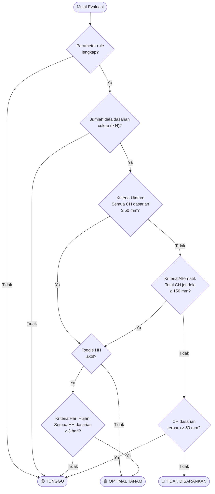

# Flowchart Rule Engine Evaluasi Onset Musim Tanam Padi

Dokumen ini menyajikan diagram alur (*flowchart*) proses evaluasi rule engine MyFarmer dalam menentukan rekomendasi awal musim tanam padi berdasarkan data curah hujan dasarian.

---

## Diagram Alur

---

## Penjelasan Setiap Langkah

### 1. Validasi Parameter Rule

Langkah pertama memastikan kelima parameter rule tersedia dan lengkap sebelum evaluasi dimulai:

| Parameter | Tipe | Default | Fungsi |
|---|---|---|---|
| `min_curah_hujan_dasarian` | number | 50 mm | Batas minimum CH per dasarian |
| `min_dasarian_berturut` | integer | 3 | Jumlah dasarian dalam jendela evaluasi |
| `total_alternatif_mm` | number | 150 mm | Minimum total CH seluruh jendela |
| `pakai_kriteria_hari_hujan` | boolean | true | Toggle penguatan hari hujan |
| `min_hari_hujan_dasarian` | integer | 3 hari | Minimum hari hujan per dasarian |

Jika salah satu parameter tidak tersedia, evaluasi dihentikan dan status dikembalikan sebagai **TUNGGU** karena sistem belum memiliki dasar evaluasi yang cukup.

### 2. Pemeriksaan Kelengkapan Data Dasarian

Sistem mengambil N dasarian berurutan yang berakhir pada dasarian target, diurutkan secara kronologis. Pada konfigurasi default, N = 3 dasarian (sekitar 30 hari).

Jika jumlah data dasarian yang tersedia kurang dari N, status dikembalikan sebagai **TUNGGU** karena jendela evaluasi belum lengkap.

### 3. Kriteria Utama (Curah Hujan Berturut-turut)

Kriteria utama memeriksa apakah **seluruh** dasarian dalam jendela evaluasi memenuhi batas minimum curah hujan. Pada konfigurasi default, setiap dasarian harus memiliki curah hujan ≥ 50 mm.

Kriteria ini mengadopsi prinsip penentuan awal musim hujan yang umum digunakan BMKG, yaitu curah hujan sekurang-kurangnya 50 mm dalam tiga dasarian berturut-turut (Surmaini & Syahbuddin, 2016).

- **Terpenuhi** → lanjut ke pemeriksaan hari hujan.
- **Tidak terpenuhi** → lanjut ke kriteria alternatif.

### 4. Kriteria Alternatif (Total Curah Hujan Jendela)

Jika kriteria utama tidak terpenuhi, sistem baru memeriksa kriteria alternatif. Jalur alternatif lulus ketika **total** curah hujan seluruh jendela ≥ 150 mm, tanpa syarat minimum tambahan pada dasarian tertentu.

Kriteria ini mengakomodasi kondisi distribusi hujan yang tidak merata antar dasarian namun secara akumulatif masih memadai.

- **Terpenuhi** → lanjut ke pemeriksaan hari hujan.
- **Tidak terpenuhi** → periksa curah hujan dasarian terbaru.

### 5. Pemeriksaan Toggle Hari Hujan

Sebelum mengeluarkan status optimal, sistem memeriksa apakah penguatan kriteria hari hujan diaktifkan (`pakai_kriteria_hari_hujan`).

- **Tidak aktif** → langsung **OPTIMAL TANAM** (kriteria CH sudah cukup).
- **Aktif** → lanjut ke pemeriksaan kriteria hari hujan.

### 6. Kriteria Hari Hujan (Penguatan Jawa Timur)

Jika toggle aktif, sistem memeriksa apakah **setiap** dasarian dalam jendela memiliki jumlah hari hujan ≥ 3 hari. Satu hari dihitung sebagai hari hujan jika curah hujan harian ≥ 0,5 mm.

Kriteria ini mengikuti kajian Ulfah dan Sulistya (2015) yang menyimpulkan bahwa untuk wilayah Jawa Timur, penentuan awal musim hujan yang sesuai mensyaratkan CH ≥ 50 mm **dan** HH ≥ 3 hari per dasarian.

- **Terpenuhi** → **OPTIMAL TANAM**.
- **Tidak terpenuhi** → **TUNGGU** (akumulasi hujan cukup, tetapi frekuensi hari hujan belum merata).

### 7. Pemeriksaan Curah Hujan Dasarian Terbaru

Langkah ini hanya dicapai jika kriteria utama dan alternatif **gagal**. Sistem memeriksa apakah dasarian terbaru (terakhir) dalam jendela setidaknya mencapai batas minimum curah hujan.

- **CH terbaru ≥ 50 mm** → **TUNGGU** (ada indikasi awal hujan, namun jendela evaluasi belum terpenuhi secara keseluruhan).
- **CH terbaru < 50 mm** → **TIDAK DISARANKAN** (indikator hujan terkini belum mendukung awal tanam).

---

## Ringkasan Status Rekomendasi

| Status | Emoji | Kondisi | Interpretasi |
|---|---|---|---|
| **Optimal Tanam** | 🟢 | Kriteria CH (utama/alternatif) lulus **dan** kriteria HH lulus atau dinonaktifkan | Indikator hujan mendukung awal musim tanam |
| **Tunggu** | 🟡 | Data/parameter belum lengkap, kriteria CH lulus tetapi HH gagal, atau CH dasarian terbaru memadai namun jendela belum lengkap | Kondisi belum cukup untuk keputusan, pantau dasarian berikutnya |
| **Tidak Disarankan** | 🔴 | Kriteria CH (utama dan alternatif) gagal **dan** CH dasarian terbaru di bawah minimum | Indikator hujan terkini belum mendukung awal tanam |

---

## Contoh Kasus Evaluasi

Semua contoh menggunakan parameter default (CH_min = 50 mm, N = 3, total_alt = 150 mm, HH_min = 3 hari).

| Kasus | CH per Dasarian | HH per Dasarian | Toggle HH | Hasil | Alur pada Flowchart |
|---|---|---|---|---|---|
| A | 55, 60, 70 mm | 3, 4, 5 hari | Aktif | 🟢 Optimal | Parameter ✓ → Data ✓ → Utama ✓ → Toggle aktif → HH ✓ |
| B | 38,4; 49,2; 268,6 mm | 3, 3, 10 hari | Aktif | 🟢 Optimal | Parameter ✓ → Data ✓ → Utama ✗ → Alternatif ✓ (total=356,2) → Toggle aktif → HH ✓ |
| C | 50, 50, 50 mm | 3, 2, 3 hari | Aktif | 🟡 Tunggu | Parameter ✓ → Data ✓ → Utama ✓ → Toggle aktif → HH ✗ |
| D | 50, 50, 50 mm | 3, 2, 3 hari | Nonaktif | 🟢 Optimal | Parameter ✓ → Data ✓ → Utama ✓ → Toggle nonaktif |
| E | 60, 30, 50 mm | 3, 3, 3 hari | Nonaktif | 🟡 Tunggu | Parameter ✓ → Data ✓ → Utama ✗ → Alternatif ✗ (total=140) → CH terbaru ✓ (50) |
| F | 60, 30, 40 mm | 3, 3, 3 hari | Nonaktif | 🔴 Tidak Disarankan | Parameter ✓ → Data ✓ → Utama ✗ → Alternatif ✗ (total=130) → CH terbaru ✗ (40) |

---

## Referensi

1. Ulfah, A., & Sulistya, W. (2015). Penentuan kriteria awal musim alternatif di wilayah Jawa Timur. *Jurnal Meteorologi dan Geofisika, 16*(3), 145–153. https://doi.org/10.31172/jmg.v16i3.285
2. Surmaini, E., & Syahbuddin, H. (2016). Kriteria awal musim tanam: Tinjauan prediksi waktu tanam padi di Indonesia. *Jurnal Penelitian dan Pengembangan Pertanian, 35*(2), 47–56. https://doi.org/10.21082/jp3.v35n2.2016.p47-56

---

*Dokumen ini disusun berdasarkan implementasi rule engine MyFarmer. Lihat [RULE_BASE.md](RULE_BASE.md) untuk dokumentasi teknis lengkap dan [RuleEngineService.php](myfarmer/app/Services/RuleEngineService.php) untuk kode sumber implementasi.*
